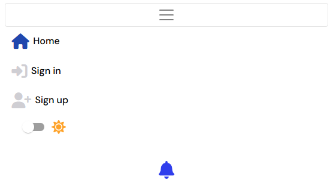

<h1 align="center">📱✨ <a href=https://la-vie-pp5-c334770967ef.herokuapp.com/>La Vie | Own IT</a> ✨📱</h1>

## The purpose of this project is a web-based social media platform called **La Vie**, designed to provide users with a safe and engaging space to share content, interact with others, and customize their experience. Built using **React** and **Django REST Framework**, the platform uses a modern and dynamic interface alongside a robust backend system.

### Key Features:

- **Authentication & Authorization**:  
  Secure user registration and login functionality, allowing users to create and manage their accounts.

- **Posting and Engagement**:  
  Users can create posts, comment on others' posts, and engage with content shared by the community.

- **Notifications**:  
  Users receive real-time notifications for likes, comments, and new followers, ensuring they stay updated on interactions.

- **Blocking Unwanted Users**:  
  A feature that enables users to block individuals they do not wish to interact with, fostering a safer environment.

- **Reporting Users and Posts**:  
  Users can report inappropriate behavior or content to ensure a respectful community.

- **Light/Dark Theme Toggle**:  
  A customizable user interface with the ability to switch between light and dark themes for personalized comfort.

- **Profile Management**:  
  Users can manage their profiles, including uploading profile images stored securely using Cloudinary.

- **API Integration**:  
  Backend API endpoints provide efficient handling of user interactions, post creation, notifications, and reporting.

- **Media Management**:  
  Integration with Cloudinary allows efficient upload, storage, and management of images within the platform.

---

The platform is built with **React** for the front-end, **Django REST Framework** for the back-end, and **PostgreSQL** for reliable database management, ensuring scalability, performance, and security.

[User Stories](#user-stories)

[User Experience](#user-experience)

- [Typography & Colors](#typography--color-scheme)
- [Agile planning](#agile-planning)
- [Features](#features)

[Wireframes](#wireframes)

- [Database design](#database-design)

[Technology stack](#technology-stack)

- [Tools used](#tools-used)

[Issues](#issues)

- [Fixed bugs](#fixed-bugs)

- [Unfixed bugs](#unfixed-bugs)

[Testing](#testing)

[Deployment](#deployment)

- [Via Heroku](#via-heroku)
- [Via Forking](#via-forking)

[Credits](#credits)

- [Media](#media)

## [User Stories](https://github.com/users/Dimitris112/projects/8/views/1)

1. Profiles - User

- **As a** user, **I want** a profile with my name, password, email, and profile picture **to** personalize my account.
- **Acceptance:** Users can upload a profile picture, update their name and password, and view stored profile information.

2. Posts - User

- **As a** user, **I want** to create posts with text and optional images **to** share content with others.
- **Acceptance:** Users can write text, upload an image, save posts to the database, edit or delete their own posts, and report posts displayed on the feed.

3. Likes - User

- **As a** user, **I want** to like posts **to** show appreciation for content.
- **Acceptance:** Users can click a "like" button, see the like count update dynamically, and unlike a post.

4. Comments - User

- **As a** user, **I want** to comment on posts **to** engage in discussions.
- **Acceptance:** Users can add a comment to any post, view comments in chronological order under the post, edit them, and delete their own comments.

5. Followers - User

- **As a** user, **I want** to follow or unfollow other users **to** see their posts on my feed.
- **Acceptance:** Users can follow or unfollow others with a button click, follow relationships are saved to the database, and users can see the number of followers and following on their profile.

6. Reports - User

- **As a** user, **I want** to report inappropriate posts and profiles **to** help the platform maintain a safe environment.
- **Acceptance:** Users can click a "report" button on posts or profiles, provide a reason, and save it to the database. Users can view reported posts and profiles on a dedicated page. Admins can view a list of reported posts and profiles.

7. Notifications - User

- **As a** user, **I want** to receive notifications for actions like likes, comments, and follows **to** stay updated on interactions.
- **Acceptance:** Users receive notifications for new likes, comments, and follows, which are stored and displayed in a notifications panel. Users can mark notifications as read.

8. Most Followed Profiles

- **As a** user, **I want** to see a list of the most followed profiles **to** discover popular users and engage with trending content.
- **Acceptance:** Users can view a ranked list of profiles with the highest follower counts, including the username and profile picture. Users can click on a profile to visit their page and follow/unfollow them. The list updates dynamically as follower counts change.

9. Profiles - Admin

- **As an** admin, **I want** to manage user profiles **to** deactivate or delete accounts if needed.
- **Acceptance:** Admin can view a list of all user profiles with their email and creation date, deactivate a user account, permanently delete a user account, and deactivated accounts cannot log in.

10. Posts - Admin

- **As an** admin, **I want** to manage posts **to** remove inappropriate content from the platform.
- **Acceptance:** Admin can view all posts with filters for date, user, or flagged posts, delete any post, and permanently remove deleted posts from the database. Admin actions are logged for accountability.

11. Reports - Admin

- **As an** admin, **I want** to view all submitted reports **to** take action on inappropriate content.
- **Acceptance:** Admin can view all submitted reports with details like the post, reason, and reporting user. Admin can take action directly from the report (e.g., delete post, warn user, or dismiss report). Admin can filter reports by status (pending, resolved), and resolved reports are marked as reviewed and archived for record-keeping.

12. Block - User

- **As a** user, **I want** to block other users **to** prevent them from interacting with me or seeing my posts.
- **Acceptance:** Users can block another user from their profile or the blocked user's profile. Once blocked, the user cannot follow, comment on, or like the blocker’s posts. Blocked users cannot send direct messages or interact with the blocker in any way. The user can unblock someone at any time from their profile, and blocked users are removed from the user's followers and following list.

## User Experience

### Typography & Color Scheme

The project uses **DM Sans** for a clean, modern look with a simple, user-friendly feel. The color palette is primarily blue and white for clarity and readability:

- **Primary Color**: `#2142b2` (Deep Blue) 🔵
- **Secondary Color**: `#76a9fa` (Light Blue) 🔵
- **Background Color (Light Theme)**: `#f8f8f8` (Soft Off-White) 🤍

This creates a calming and professional feel, ideal for a social media platform while being bright and easy on the eyes.

### Agile Planning

Click to expand

This project was developed using agile methodologies over a span of approximately three weeks. The development process included the use of various labels such as "documentation," "good first issue," and "enhancement" to organize tasks and streamline progress. An MVP (Minimum Viable Product) milestone was established to focus on delivering essential features. Additionally, an "Enhancement" milestone was added to accommodate improvements and refinements throughout the project. Each user story is accompanied by a comprehensive set of acceptance criteria, ensuring that all functionalities are well defined and meet completion standards. For more details, you can view the kanban board [here](https://github.com/users/Dimitris112/projects/8).

    

### Features

    
<strong>Navigation & Footer</strong>

    

        The navigation bar includes the <strong>🏠</strong> and <strong>Profile</strong> links. For logged-in users, it includes the <strong>Sign In</strong>, <strong>Sign Up</strong>, <strong>Feed</strong>, <strong>Liked</strong>, light/dark toggle button, and a <strong>🔔</strong> (notifications) bell.
    

    

        The footer displays <em>© 2025 La Vie | Educational project by Dimitris</em> followed by <a href="https://www.linkedin.com/in/dimitrios-thlivitis/" target="_blank">My LinkedIn</a> and <a href="https://github.com/Dimitris112/La-Vie-pp5" target="_blank">My GitHub</a>.
    

    

        These elements are managed using React components, which are rendered globally across the app.
    

    <ul>
        <li>Clicking the <em>🏠</em> takes the users back to the homepage.</li>
        <li>Clicking the <em>Profile</em> takes the users to the profile page.</li>
        <li>Clicking the <em>Sign In</em> takes the users to the sign-in page.</li>
        <li>Clicking the <em>Sign Up</em> takes the users to the sign-up page.</li>
        <li>Clicking the <em>Feed</em> takes the users to the feed page.</li>
        <li>Clicking the <em>Liked</em> takes the users to the liked posts page.</li>
        <li>Clicking the <em>🔔</em> opens the notifications panel.</li>
        <li>Clicking the light/dark toggle changes the theme of the page.</li>
    </ul>
    

        

            
            
            
            
            
            
            
        

    

    

        
    

 
