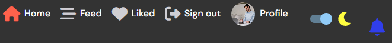

<h1 align="center">📱✨ <a href=https://la-vie-pp5-c334770967ef.herokuapp.com/>La Vie | Own IT</a> ✨📱</h1>

## The purpose of this project is a web-based social media platform called **La Vie**, designed to provide users with a safe and engaging space to share content, interact with others, and customize their experience. Built using **React** and **Django REST Framework**, the platform uses a modern and dynamic interface alongside a robust backend system.

### Key Features:

- **Authentication & Authorization**:  
  Secure user registration and login functionality, allowing users to create and manage their accounts.

- **Posting and Engagement**:  
  Users can create posts, comment on others' posts, and engage with content shared by the community.

- **Notifications**:  
  Users receive real-time notifications for likes, comments, and new followers, ensuring they stay updated on interactions.

- **Blocking Unwanted Users**:  
  A feature that enables users to block individuals they do not wish to interact with, fostering a safer environment.

- **Reporting Users and Posts**:  
  Users can report inappropriate behavior or content to ensure a respectful community.

- **Light/Dark Theme Toggle**:  
  A customizable user interface with the ability to switch between light and dark themes for personalized comfort.

- **Profile Management**:  
  Users can manage their profiles, including uploading profile images stored securely using Cloudinary.

- **API Integration**:  
  Backend API endpoints provide efficient handling of user interactions, post creation, notifications, and reporting.

- **Media Management**:  
  Integration with Cloudinary allows efficient upload, storage, and management of images within the platform.

---

The platform is built with **React** for the front-end, **Django REST Framework** for the back-end, and **PostgreSQL** for reliable database management, ensuring scalability, performance, and security.

[User Stories](#user-stories)

[User Experience](#user-experience)

- [Typography & Colors](#typography--color-scheme)
- [Agile planning](#agile-planning)
- [Features](#features)

[Wireframes](#wireframes)

- [Database design](#database-design)

[Technology stack](#technology-stack)

- [Tools used](#tools-used)

[Issues](#issues)

- [Fixed bugs](#fixed-bugs)

- [Unfixed bugs](#unfixed-bugs)

[Testing](#testing)

[Deployment](#deployment)

- [Via Heroku](#via-heroku)
- [Via Forking](#via-forking)

[Credits](#credits)

- [Media](#media)

## [User Stories](https://github.com/users/Dimitris112/projects/8/views/1)

1. Profiles - User

- **As a** user, **I want** a profile with my name, password, email, and profile picture **to** personalize my account.
- **Acceptance:** Users can upload a profile picture, update their name and password, and view stored profile information.

2. Posts - User

- **As a** user, **I want** to create posts with text and optional images **to** share content with others.
- **Acceptance:** Users can write text, upload an image, save posts to the database, edit or delete their own posts, and report posts displayed on the feed.

3. Likes - User

- **As a** user, **I want** to like posts **to** show appreciation for content.
- **Acceptance:** Users can click a "like" button, see the like count update dynamically, and unlike a post.

4. Comments - User

- **As a** user, **I want** to comment on posts **to** engage in discussions.
- **Acceptance:** Users can add a comment to any post, view comments in chronological order under the post, edit them, and delete their own comments.

5. Followers - User

- **As a** user, **I want** to follow or unfollow other users **to** see their posts on my feed.
- **Acceptance:** Users can follow or unfollow others with a button click, follow relationships are saved to the database, and users can see the number of followers and following on their profile.

6. Reports - User

- **As a** user, **I want** to report inappropriate posts and profiles **to** help the platform maintain a safe environment.
- **Acceptance:** Users can click a "report" button on posts or profiles, provide a reason, and save it to the database. Users can view reported posts and profiles on a dedicated page. Admins can view a list of reported posts and profiles.

7. Notifications - User

- **As a** user, **I want** to receive notifications for actions like likes, comments, and follows **to** stay updated on interactions.
- **Acceptance:** Users receive notifications for new likes, comments, and follows, which are stored and displayed in a notifications panel. Users can mark notifications as read.

8. Most Followed Profiles

- **As a** user, **I want** to see a list of the most followed profiles **to** discover popular users and engage with trending content.
- **Acceptance:** Users can view a ranked list of profiles with the highest follower counts, including the username and profile picture. Users can click on a profile to visit their page and follow/unfollow them. The list updates dynamically as follower counts change.

9. Profiles - Admin

- **As an** admin, **I want** to manage user profiles **to** deactivate or delete accounts if needed.
- **Acceptance:** Admin can view a list of all user profiles with their email and creation date, deactivate a user account, permanently delete a user account, and deactivated accounts cannot log in.

10. Posts - Admin

- **As an** admin, **I want** to manage posts **to** remove inappropriate content from the platform.
- **Acceptance:** Admin can view all posts with filters for date, user, or flagged posts, delete any post, and permanently remove deleted posts from the database. Admin actions are logged for accountability.

11. Reports - Admin

- **As an** admin, **I want** to view all submitted reports **to** take action on inappropriate content.
- **Acceptance:** Admin can view all submitted reports with details like the post, reason, and reporting user. Admin can take action directly from the report (e.g., delete post, warn user, or dismiss report). Admin can filter reports by status (pending, resolved), and resolved reports are marked as reviewed and archived for record-keeping.

12. Block - User

- **As a** user, **I want** to block other users **to** prevent them from interacting with me or seeing my posts.
- **Acceptance:** Users can block another user from their profile or the blocked user's profile. Once blocked, the user cannot follow, comment on, or like the blocker’s posts. Blocked users cannot send direct messages or interact with the blocker in any way. The user can unblock someone at any time from their profile, and blocked users are removed from the user's followers and following list.

## User Experience

### Typography & Color Scheme

The project uses **DM Sans** for a clean, modern look with a simple, user-friendly feel. The color palette is primarily blue and white for clarity and readability:

- **Primary Color**: `#2142b2` (Deep Blue) 🔵
- **Secondary Color**: `#76a9fa` (Light Blue) 🔵
- **Background Color (Light Theme)**: `#f8f8f8` (Soft Off-White) 🤍

This creates a calming and professional feel, ideal for a social media platform while being bright and easy on the eyes.

### Agile Planning

Click to expand

This project was developed using agile methodologies over a span of approximately three weeks. The development process included the use of various labels such as "documentation," "good first issue," and "enhancement" to organize tasks and streamline progress. An MVP (Minimum Viable Product) milestone was established to focus on delivering essential features. Additionally, an "Enhancement" milestone was added to accommodate improvements and refinements throughout the project. Each user story is accompanied by a comprehensive set of acceptance criteria, ensuring that all functionalities are well defined and meet completion standards. For more details, you can view the kanban board [here](https://github.com/users/Dimitris112/projects/8).

    

### Features

    
<strong>Navigation & Footer</strong>

    

        The navigation bar includes the <strong>🏠</strong> and <strong>Profile</strong> links. For logged-in users, it includes the <strong>Sign In</strong>, <strong>Sign Up</strong>, <strong>Feed</strong>, <strong>Liked</strong>, light/dark toggle button, and a <strong>🔔</strong> (notifications) bell.
    

    

        The footer displays <em>© 2025 La Vie | Educational project by Dimitris</em> followed by <a href="https://www.linkedin.com/in/dimitrios-thlivitis/" target="_blank">My LinkedIn</a> and <a href="https://github.com/Dimitris112/La-Vie-pp5" target="_blank">My GitHub</a>.
    

    

        These elements are managed using React components, which are rendered globally across the app.
    

    <ul>
        <li>Clicking the <em>🏠</em> takes the users back to the homepage.</li>
        <li>Clicking the <em>Profile</em> takes the users to the profile page.</li>
        <li>Clicking the <em>Sign In</em> takes the users to the sign-in page.</li>
        <li>Clicking the <em>Sign Up</em> takes the users to the sign-up page.</li>
        <li>Clicking the <em>Feed</em> takes the users to the feed page.</li>
        <li>Clicking the <em>Liked</em> takes the users to the liked posts page.</li>
        <li>Clicking the <em>🔔</em> opens the notifications panel.</li>
        <li>Clicking the light/dark toggle changes the theme of the page.</li>
    </ul>
    

        

            
            
            
            
            
            
            
        

    

    

        
    

 

  
<strong>Homepage</strong>

  

      The homepage serves as the entry point for users, displaying a dynamic feed of posts. On the top-left side of the PC view, there's the platform's logo, which acts as an anchor link to the homepage, allowing users to return to the feed at any time. Next to the logo is the <strong>Add Post</strong> button, which directs users to the <em>create post</em> page where they can share content.
      

  

      Users can see a <strong>search posts bar</strong> that allows them to search for posts or authors by typing letters. This search functionality displays matching results in real-time refreshed every second.
  

  

       Also, the right side of the screen showcases a list of the <strong>most followed profiles</strong>, and users can follow or unfollow profiles directly from this section.
  

  

        

            
            
            
            
        

  

 

    
<strong>Create Post</strong>

    

        The <strong>Create Post</strong> feature allows users to upload posts that include an image, a title, and content. To create a post, users click the <strong>"Upload"</strong> icon.
    

    

        Below the upload icon, there is a <strong>"Click to upload an image"</strong> message, guiding users to upload an image for their post. This is followed by a note indicating the <strong>maximum width and height</strong> of the image (4096px) and the <strong>maximum file size</strong> (2MB).
    

    

        Next, users are prompted to enter the <strong>Title</strong> of their post and provide <strong>Content</strong> for the post description.
    

    

        At the bottom of the page, users have the option to click on either a <strong>Cancel</strong> or a <strong>Create</strong> button. The <strong>Create</strong> button will remain disabled until the user has filled out all required fields: image, title, and content.
    

    

        Once the post is created, the user is redirected to the post's dedicated page where they can view or add comments. If no comments have been made yet, a message will appear: <strong>"No comments yet! Be the first one to comment!"</strong>
    

  

        
  

 

    
<strong>Post Page</strong>

    

        On the <strong>Post Page</strong>, users can view the full post with the following components:
    

    <ul>
        <li><strong>Post Image:</strong> The image associated with the post.</li>
        <li><strong>Author Information:</strong> The username and avatar of the post's author.</li>
        <li><strong>Title:</strong> The title of the post.</li>
        <li><strong>Content:</strong> The full content of the post.</li>
    </ul>
    

        Along with the post content, users will see the following interaction buttons:
    

    <ul>
        <li><strong>Like Button:</strong> Represented by a heart emoji, this allows users to "like" the post. When hovering over the heart, the overlay text "Like post" is shown. A user must be logged in and not be the post owner to like the post.</li>
        <li><strong>Comments Button:</strong> Represented by dialogue cloud emojis, this button allows users to view and post comments. The overlay text "Total comments" is shown when hovering over it.</li>
        <li><strong>Views Count:</strong> Displayed as an eye emoji, showing the total number of views the post has received. Hovering over it shows the overlay text "Total views."</li>
        <li><strong>Report Button:</strong> Represented by a flag emoji, this allows users to report a post. When hovering over it, the overlay text "Report post" is shown. To report, users must be logged in and cannot be the owner of the post.</li>
    </ul>
    

        To interact with the "Like" and "Report" buttons, users must be logged in and cannot be the owner of the post.
    

    

        Below the post content, there is a <strong>Comments Section</strong> where users can:
    

    <ul>
        <li><strong>Write a Comment:</strong> Users can type in a comment in a text area with the placeholder text "Write your comment...". The <strong>Post</strong> button below the text area is disabled until at least one character is entered into the comment box.</li>
        <li><strong>Display of Comments:</strong> Comments are shown below the post in chronological order.</li>
        <li><strong>Infinite Scroll:</strong> The comments section includes infinite scroll functionality, allowing users to smoothly scroll through comments as they load more.</li>
        <li><strong>Comment Editing and Deleting:</strong> Users can edit or delete their own comments.</li>
    </ul>
    

        To leave a comment, users must be logged in.
    

  

        
    

### Wireframes

The wireframes have been designed for both PC and mobile screens to provide a visual representation of each page's layout and functionality.

<table style="width: 100%; border-collapse: collapse;">
    <tr>
        <th style="text-align: center;">Home</th>
        <th style="text-align: center;">Sign Up</th>
        <th style="text-align: center;">Sign In</th>
        <th style="text-align: center;">Profile</th>
        <th style="text-align: center;">Testimonials</th>
    </tr>
    <tr>
        <td style="text-align: center; vertical-align: top;">
            

                
                
            

        </td>
        <td style="text-align: center; vertical-align: top;">
            

                
                
            

        </td>
        <td style="text-align: center; vertical-align: top;">
            

                
                
            

        </td>
        <td style="text-align: center; vertical-align: top;">
            

                
                
            

        </td>
        <td style="text-align: center; vertical-align: top;">
            

                
                
            

        </td>
    </tr>
</table>

### Database design

The database was designed to allow CRUD functionality to registered users.

- Users can register, log in, and manage their profiles, allowing for the creation and updating of personal information and images in the `user_profiles` table.
- Reservations enable users to create, view, and modify their bookings, with relevant details like name, reservation time, special requests, and guest count stored in the `reservations` table.
- The Testimonials table allows users to submit their experiences, read others' testimonials, and update or delete their submissions as needed. It includes ratings and counters for views and comments to enhance community interaction.
- Comments associated with testimonials allow users to provide feedback, with the ability to add, edit, or delete their comments.

The ERD (Entity Relationship Diagram) was designed on [dbdiagram.io](https://dbdiagram.io/d)

  

      
  

## Technology Stack

<table>
  <tr>
    <td valign="top">
      <h3>Technology Used</h3>
      <table>
        <tr>
          <td><strong>Backend</strong></td>
          <td style="text-align:right;">Django 5.1.1 <code>Django==5.1.1</code></td>
        </tr>
        <tr>
          <td><strong>API</strong></td>
          <td style="text-align:right;">Django REST Framework <code>djangorestframework==3.15.2</code></td>
        </tr>
        <tr>
          <td><strong>Database</strong></td>
          <td style="text-align:right;">PostgreSQL <code>psycopg2==2.9.9</code></td>
        </tr>
        <tr>
          <td><strong>Authentication</strong></td>
          <td style="text-align:right;">Django Allauth <code>django-allauth==64.2.1</code></td>
        </tr>
        <tr>
          <td><strong>Frontend</strong></td>
          <td style="text-align:right;">JavaScript, JSON, HTML5, CSS3</td>
        </tr>
        <tr>
          <td><strong>Styling</strong></td>
          <td style="text-align:right;">Crispy Forms + Bootstrap 5 <code>crispy-bootstrap5==2024.2</code></td>
        </tr>
        <tr>
          <td><strong>Media Storage</strong></td>
          <td style="text-align:right;">Cloudinary <code>cloudinary==1.41.0</code></td>
        </tr>
        <tr>
          <td><strong>Static Files</strong></td>
          <td style="text-align:right;">Whitenoise <code>whitenoise==6.7.0</code></td>
        </tr>
        <tr>
          <td><strong>Server</strong></td>
          <td style="text-align:right;">Gunicorn <code>gunicorn==23.0.0</code></td>
        </tr>
        <tr>
          <td><strong>Image Handling</strong></td>
          <td style="text-align:right;">Pillow <code>pillow==10.4.0</code></td>
        </tr>
      </table>
    </td>
    <td valign="top" style="padding-left: 20px;">
      <h3>Other Dependencies</h3>
      <ul style="list-style-type: none; padding-left: 0;">
        <li><code>asgiref==3.8.1</code></li>
        <li><code>dj-database-url==2.2.0</code></li>
        <li><code>dj3-cloudinary-storage==0.0.6</code></li>
        <li><code>django-crispy-forms==2.3</code></li>
        <li><code>django-summernote==0.8.20.0</code></li>
        <li><code>oauthlib==3.2.2</code></li>
        <li><code>PyJWT==2.9.0</code></li>
        <li><code>python3-openid==3.2.0</code></li>
        <li><code>requests-oauthlib==2.0.0</code></li>
        <li><code>sqlparse==0.5.1</code></li>
        <li><code>urllib3==1.26.20</code></li>
      </ul>
    </td>
  </tr>
</table>

### Tools used

- Git: Used commands such as `git` `add` - `commit -m "message'` - `push`.
- Gitpod: Used as my IDE.
- Github: Used as the code hosting.
- [Font awesome](https://fontawesome.com/): Used for a variety of icons through the pages.
- [Favicon io](https://favicon.io/favicon-converter/): Used to generate the faveicon.
- [Balsamiq](https://balsamiq.com/wireframes/desktop/): Used to create the wireframes - desktop version.
- [TinyPNG](https://tinypng.com/): Used to compress each image used in the project for optimal load times.
- [dbdiagraim.io](https://dbdiagram.io/home): Used to create the ERD.
- [GSAP](https://gsap.com/): Used for the animations on the 404 page.

## Fixed bugs

    
Patch 1.0.0

    

        

            <table style="margin: 0 auto; border-collapse: collapse; width: 100%;">
                <tr>
                    <th>Issue</th>
                    <th>Description of Fix</th>
                    <th>Pass/Fail</th>
                </tr>
                <tr>
                    <td>Drinks and Drink Detail Modals Collision</td>
                    <td>Resolved the collision issue between drinks and drink detail modals.</td>
                    <td>Pass</td>
                </tr>
                <tr>
                    <td>UserProfile Image Upload Error</td>
                    <td>Fixed the issue where image uploads to UserProfile were failing due to file size restrictions.</td>
                    <td>Pass</td>
                </tr>
                <tr>
                    <td>Reservation Date Duplication</td>
                    <td>Corrected the logic to prevent users from making multiple reservations on the same date.</td>
                    <td>Pass</td>
                </tr>
                <tr>
                    <td>Testimonial Character Count Validation</td>
                    <td>Enhanced validation to ensure comments do not exceed 50 characters.</td>
                    <td>Pass</td>
                </tr>
                <tr>
                    <td>Navbar Active Link Highlighting</td>
                    <td>Improved the active link highlighting on the navbar for better navigation.</td>
                    <td>Pass</td>
                </tr>
            </table>
        

    

    
Patch 1.0.1

    

        

            <table style="margin: 0 auto; border-collapse: collapse; width: 100%;">
                <tr>
                    <th>Issue</th>
                    <th>Description of Fix</th>
                    <th>Pass/Fail</th>
                </tr>
                <tr>
                    <td>UserProfile Form Validation</td>
                    <td>Improved validation for image formats in the UserProfile form.</td>
                    <td>Pass</td>
                </tr>
                <tr>
                    <td>User Data Update</td>
                    <td>Fixed issues in the UserForm to ensure proper data updates.</td>
                    <td>Pass</td>
                </tr>
                <tr>
                    <td>Profile Template Changes</td>
                    <td>Updated profile template to enhance user experience during profile updates.</td>
                    <td>Pass</td>
                </tr>
                <tr>
                    <td>Reset Profile Picture Functionality</td>
                    <td>Ensured reset functionality correctly sets the profile image to None.</td>
                    <td>Pass</td>
                </tr>
                <tr>
                    <td>Improved Form Handling</td>
                    <td>Refined form handling in the views to enhance performance.</td>
                    <td>Pass</td>
                </tr>
                <tr>
                    <td>Cloudinary URL Error</td>
                    <td>Fixed error from Cloudinary URL when changing profile info.</td>
                    <td>Pass</td>
                </tr>
                <tr>
                    <td>Editing Testimonials</td>
                    <td>Fixed issues in the testimonials editing process and display updated timestamps correctly.</td>
                    <td>Pass</td>
                </tr>
            </table>
        

    

    
Patch 1.0.2

    

        

            <table style="margin: 0 auto; border-collapse: collapse; width: 100%;">
                <tr>
                    <th>Issue</th>
                    <th>Description of Fix</th>
                    <th>Pass/Fail</th>
                </tr>
                <tr>
                    <td>User Authentication</td>
                    <td>Implemented a login requirement for making reservations, ensuring only authenticated users can access this feature.</td>
                    <td>Pass</td>
                </tr>
                <tr>
                    <td>Reservation Restrictions</td>
                    <td>Added logic to prevent users from making multiple reservations on the same date.</td>
                    <td>Pass</td>
                </tr>
                <tr>
                    <td>Admin Panel Enhancements</td>
                    <td>Strengthened admin-only access for creating events to enhance security.</td>
                    <td>Pass</td>
                </tr>
                <tr>
                    <td>Content Management</td>
                    <td>Adjusted testimonial and comment models to validate content length, improving the quality of user-generated content.</td>
                    <td>Pass</td>
                </tr>
                <tr>
                    <td>UI/UX Improvements</td>
                    <td>Enhanced CSS for better contrast and accessibility.</td>
                    <td>Pass</td>
                </tr>
                <tr>
                    <td>Testing and Quality Assurance</td>
                    <td>Improved testing for user profile APIs and reservation functionality to ensure stability.</td>
                    <td>Pass</td>
                </tr>
                <tr>
                    <td>Documentation Updates</td>
                    <td>Updated README.md to include the new ERD section and relevant videos, with clearer issue descriptions.</td>
                    <td>Pass</td>
                </tr>
            </table>
        

    

    
Patch 1.0.3

    

        

            <table style="margin: 0 auto; border-collapse: collapse; width: 100%;">
                <tr>
                    <th>Issue</th>
                    <th>Description of Fix</th>
                    <th>Pass/Fail</th>
                </tr>
                <tr>
                    <td>Username Case Insensitivity</td>
                    <td>Implemented CaseInsensitiveUsernameBackend to allow login with lowercase or uppercase usernames.</td>
                    <td>Pass</td>
                </tr>
                <tr>
                    <td>Custom Login View Update</td>
                    <td>Updated CustomLoginView to authenticate users with case-insensitive usernames.</td>
                    <td>Pass</td>
                </tr>
                <tr>
                    <td>Added backends.py</td>
                    <td>Created backends.py in the bar app to handle custom authentication logic.</td>
                    <td>Pass</td>
                </tr>
                <tr>
                    <td>Settings Update</td>
                    <td>Updated settings.py to include the custom authentication backend.</td>
                    <td>Pass</td>
                </tr>
                <tr>
                    <td>Comment Character Limit</td>
                    <td>Updated comment editing functionality to restrict character count to a maximum of 50 characters and changed color indication for exceeding limit.</td>
                    <td>Pass</td>
                </tr>
                <tr>
                    <td>Was Edited Field</td>
                    <td>Added <code>was_edited</code> field to Comment model and updated relevant migration files.</td>
                    <td>Pass</td>
                </tr>
            </table>
        

    

    
Patch 1.0.4

    

        

            <table style="margin: 0 auto; border-collapse: collapse; width: 100%;">
                <tr>
                    <th>Issue</th>
                    <th>Description of Fix</th>
                    <th>Pass/Fail</th>
                </tr>
                <tr>
                    <td>Fixed Testimonial Deletions</td>
                    <td>Updated the delete functionality for testimonials to ensure proper handling and messaging in the admin panel.</td>
                    <td>Pass</td>
                </tr>
                <tr>
                    <td>Comment Functionality Update</td>
                    <td>Improved comment section UI and backend handling for better user experience.</td>
                    <td>Pass</td>
                </tr>
                <tr>
                    <td>Admin Panel Enhancements</td>
                    <td>Updated TestimonialAdmin to display comment counts and included additional fields in the admin view for better management.</td>
                    <td>Pass</td>
                </tr>
                <tr>
                    <td>Textarea Update in Add Testimonial</td>
                    <td>Updated textarea for testimonial content to enforce character limits.</td>
                    <td>Pass</td>
                </tr>
                <tr>
                    <td>Improved Delete Testimonial Template</td>
                    <td>Enhanced the delete testimonial template for clearer user messaging and action confirmation.</td>
                    <td>Pass</td>
                </tr>
                <tr>
                    <td>Testimonial List Enhancements</td>
                    <td>Improved the layout and functionality of the testimonial list page, including comment display and delete buttons.</td>
                    <td>Pass</td>
                </tr>
                <tr>
                    <td>Security on Edit and Delete</td>
                    <td>Added permission checks to ensure only authorized users can edit or delete testimonials and comments.</td>
                    <td>Pass</td>
                </tr>
            </table>
        

    

    
Patch 1.0.5

    

        

            <table style="margin: 0 auto; border-collapse: collapse; width: 100%;">
                <tr>
                    <th>Issue</th>
                    <th>Description of Fix</th>
                    <th>Pass/Fail</th>
                </tr>
                <tr>
                    <td>JavaScript Code Duplication</td>
                    <td>Removed duplicate lines of code for variable declarations and event listeners to improve readability and maintainability.</td>
                    <td>Pass</td>
                </tr>
                <tr>
                    <td>Update Available Spots Logic</td>
                    <td>Refactored the logic for updating available spots based on reservation input to ensure accurate calculations.</td>
                    <td>Pass</td>
                </tr>
                <tr>
                    <td>Validation for Future Reservations</td>
                    <td>Implemented validation to ensure that reservations can only be made for future dates and times, enhancing user experience.</td>
                    <td>Pass</td>
                </tr>
                <tr>
                    <td>Error Handling in Fetch Requests</td>
                    <td>Added error handling to the fetch request for availability to provide clear feedback in case of network issues.</td>
                    <td>Pass</td>
                </tr>
                <tr>
                    <td>Improve Alert Messaging</td>
                    <td>Enhanced alert messaging to provide users with clearer instructions regarding reservation limits and issues.</td>
                    <td>Pass</td>
                </tr>
                <tr>
                    <td>UI Improvements for Time Selection</td>
                    <td>Updated the time selection UI to ensure users can only select valid time options for their reservations.</td>
                    <td>Pass</td>
                </tr>
                <tr>
                    <td>Clearer Comments for Future Dates</td>
                    <td>Provided clearer comments in the code for future dates validation to aid developers in understanding the logic.</td>
                    <td>Pass</td>
                </tr>
            </table>
        

    

    
Patch 1.0.6

    

        

            <table style="margin: 0 auto; border-collapse: collapse; width: 100%;">
                <tr>
                    <th>Issue</th>
                    <th>Description of Fix</th>
                    <th>Pass/Fail</th>
                </tr>
                <tr>
                    <td>Fix Hour Option Population</td>
                    <td>Refactored the hour options population logic to ensure proper formatting and prevent duplicates in the hour selection dropdown.</td>
                    <td>Pass</td>
                </tr>
                <tr>
                    <td>Fix Minute Option Population</td>
                    <td>Corrected the population of minute options to avoid duplication and ensure that only valid minute intervals are displayed.</td>
                    <td>Pass</td>
                </tr>
                <tr>
                    <td>Update Available Spots Logic</td>
                    <td>Revised the available spots calculation to accommodate new logic and ensure it reflects the correct number of spots based on input.</td>
                    <td>Pass</td>
                </tr>
                <tr>
                    <td>Validation for Reservation Date and Time</td>
                    <td>Improved validation checks to ensure the selected reservation time and date are in the future, enhancing usability.</td>
                    <td>Pass</td>
                </tr>
                <tr>
                    <td>Consistent API Response Handling</td>
                    <td>Ensured consistency in how API responses are handled, with error checking for network responses to improve reliability.</td>
                    <td>Pass</td>
                </tr>
                <tr>
                    <td>Alert Function Enhancements</td>
                    <td>Enhanced the alert function to provide clearer feedback messages to users when input is invalid or unavailable.</td>
                    <td>Pass</td>
                </tr>
                <tr>
                    <td>Comment Documentation Improvement</td>
                    <td>Improved inline comments within the code to clarify the purpose of functions and logic for better maintainability.</td>
                    <td>Pass</td>
                </tr>
            </table>
        

    

    
Patch 1.0.7

    

        

            <table style="margin: 0 auto; border-collapse: collapse; width: 100%;">
                <tr>
                    <th>Issue</th>
                    <th>Description of Fix</th>
                    <th>Pass/Fail</th>
                </tr>
                <tr>
                    <td>Validation Logic for Reservation Time</td>
                    <td>Improved the clean method in ReservationForm to ensure hour and minute selection is validated before creating the reservation time.</td>
                    <td>Pass</td>
                </tr>
                <tr>
                    <td>Error Handling for Past Reservations</td>
                    <td>Added checks to ensure users cannot create reservations in the past, with appropriate validation messages.</td>
                    <td>Pass</td>
                </tr>
                <tr>
                    <td>Existing Reservations Check</td>
                    <td>Implemented checks in both the form and view logic to prevent users from making multiple reservations on the same date.</td>
                    <td>Pass</td>
                </tr>
                <tr>
                    <td>Refactored Code for Readability</td>
                    <td>Refactored the form and view code to enhance readability and maintainability, reducing duplication of logic.</td>
                    <td>Pass</td>
                </tr>
                <tr>
                    <td>Consistent User Messaging</td>
                    <td>Standardized error messages across different views for consistency in user experience when handling reservations.</td>
                    <td>Pass</td>
                </tr>
                <tr>
                    <td>Enhanced Reservation Logic</td>
                    <td>Updated the reservation creation and editing logic to better handle user input and reservation time management.</td>
                    <td>Pass</td>
                </tr>
                <tr>
                    <td>Documentation Updates</td>
                    <td>Enhanced comments and docstrings in the code to provide clearer explanations of the logic and validation rules implemented.</td>
                    <td>Pass</td>
                </tr>
            </table>
        

    

## Testing

For a detailed overview of both manual and automated testing processes, please refer to [TESTING.md](https://github.com/Dimitris112/rum-away-testp4/blob/main/TESTING.md). It covers all testing scenarios and methodologies used in the project.

## Deployment

### via Heroku

1. Navigate to [heroku](https://www.heroku.com/home) and create an account.
2. Click `Create new app`, enter the app name and choose your region, hit `create app`.
3. Click **Deploy** and in the _Deployment method_ option choose **Github**. Enter the repository's name and click connect, you can leave the branch deployment to `main`.
   > You need to have created your github repository.
4. Head to **Settings** and click `Reveal config vars`
5. On the KEY inputs add: DATABASE_URL - SECRET_KEY - CLOUDINARY_URL. On the VALUE inputs add your own, for each one.
6. Click **Add buildpack** and choose `python`.
7. Now you're set. Go back to `Deploy` and click **Deploy branch**.

    
    

### Via Forking

Forking a repository is commonly done to contribute to another developer's project or to use it as the foundation for your own. To fork a repository:

1. Click the **Fork** button at the top right of the repository page.
2. This will create a copy of the repository in your own GitHub account, which you can modify independently.

## Credits

🎓 **𝕽𝖔𝖍𝖎𝖙** - **Code Institute Mentor** 

💡 **[Gareth's readme](https://github.com/Gareth-McGirr/Portfolio-Project-4-SizzleAndSteak)** as inspiration to mine.

[ChatGPT 4o](https://openai.com/chatgpt/) / [Codeium](https://codeium.com/) / [Stack Overflow](https://stackoverflow.com/) for adjustments and bug fixing aid.

The main idea for this project was obtained by the [Django Blog](https://www.youtube.com/watch?v=YH--VobIA8c) walkthrough project of the [Code Institute course](https://codeinstitute.net/global/).

### Media

All photos used in the project - including favicon - were taken from [Pexels](https://www.pexels.com/) / [Unsplash](https://unsplash.com/) / [Freepik](https://www.freepik.com/).
