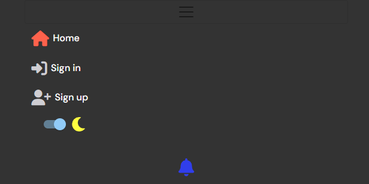
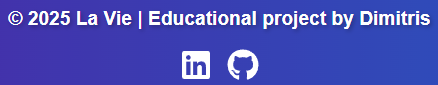
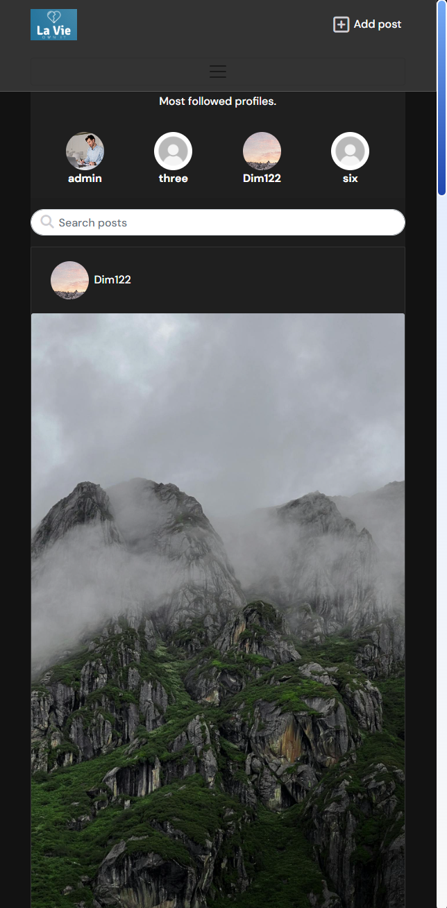
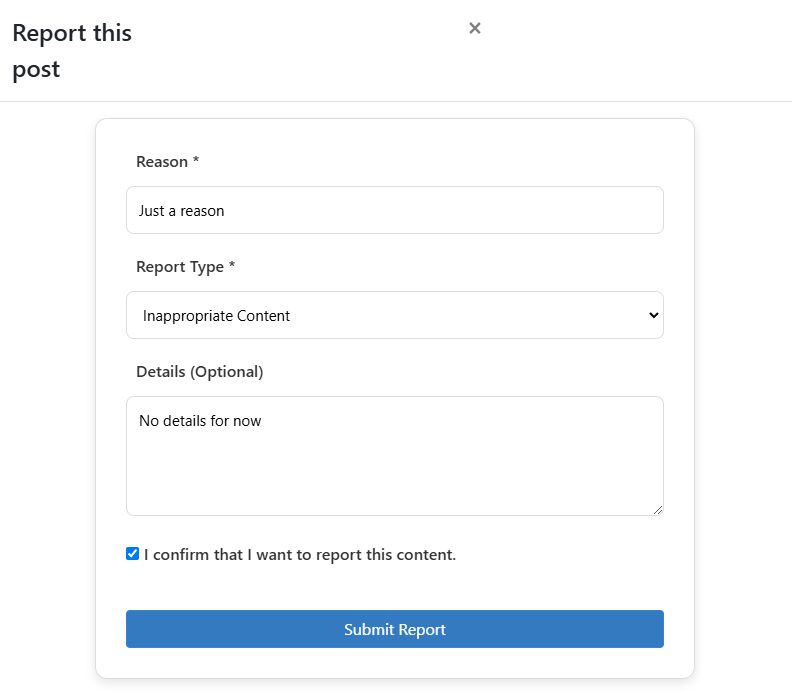
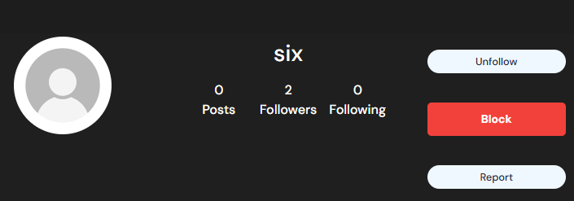
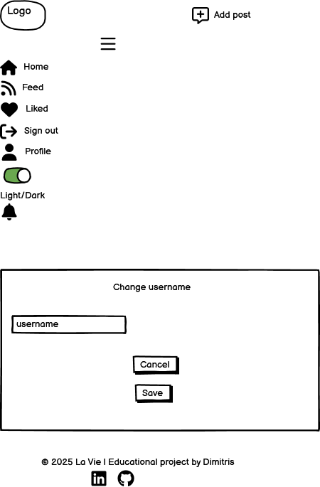
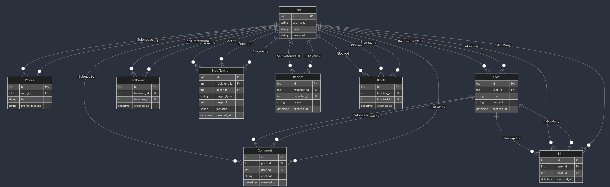

<h1 align="center">📱✨ <a href="https://la-vie-pp5-c334770967ef.herokuapp.com/">La Vie | Own IT</a> ✨📱</h1>

<div style="text-align: center;">
  
  
</div>

## The purpose of this project is a web-based social media platform called **La Vie**, designed to provide users with a safe and engaging space to share content, interact with others, and customize their experience. Built using **React** and **Django REST Framework**, the platform uses a modern and dynamic interface alongside a robust backend system.

### Key Features:

- **Authentication & Authorization**:  
  Secure user registration and login functionality, allowing users to create and manage their accounts.

- **Posting and Engagement**:  
  Users can create posts, comment on others' posts, and engage with content shared by the community.

- **Notifications**:  
  Users receive real-time notifications for likes, comments, and new followers, ensuring they stay updated on interactions.

- **Blocking Unwanted Users**:  
  A feature that enables users to block individuals they do not wish to interact with, fostering a safer environment.

- **Reporting Users and Posts**:  
  Users can report inappropriate behavior or content to ensure a respectful community.

- **Light/Dark Theme Toggle**:  
  A customizable user interface with the ability to switch between light and dark themes for personalized comfort.

- **Profile Management**:  
  Users can manage their profiles, including uploading profile images stored securely using Cloudinary.

- **API Integration**:  
  Backend API endpoints provide efficient handling of user interactions, post creation, notifications, and reporting.

- **Media Management**:  
  Integration with Cloudinary allows efficient upload, storage, and management of images within the platform.

---

The platform is built with **React** for the front-end, **Django REST Framework** for the back-end, and **PostgreSQL** for reliable database management, ensuring scalability, performance, and security.

## [Content](#content)

[User Stories](#user-stories)

[User Experience](#user-experience)

- [Typography & Colors](#typography--color-scheme)
- [Agile planning](#agile-planning)
- [Features](#features)

[Wireframes](#wireframes)

- [Database design](#database-design)

- [Relationship Overview](#relationships-overview)

[Technology stack](#technology-stack)

- [Reuseability](#reusability)

- [Technology used](#technology-used)

- [Other dependencies](#other-dependencies)

- [Tools used](#tools-used)

- [Security](#security)

[Issues](#issues)

- [Fixed bugs](#fixed-bugs)

- [Unfixed bugs](#unfixed-bugs)

[Testing](#testing)

[Deployment](#deployment)

- [Via Heroku](#via-heroku)
- [Via Forking](#via-forking)

[Credits](#credits)

- [Media](#media)

## [User Stories](https://github.com/users/Dimitris112/projects/8/views/1)

<details>
<summary>1. Profiles - User</summary>

- **As a** user, **I want** a profile with my name, password, email, and profile picture **to** personalize my account.
- **Acceptance:** Users can upload a profile picture, update their name and password, and view stored profile information.

</details>

<details>
<summary>2. Posts - User</summary>

- **As a** user, **I want** to create posts with text and optional images **to** share content with others.
- **Acceptance:** Users can write text, upload an image, save posts to the database, edit or delete their own posts, and report posts displayed on the feed.

</details>

<details>
<summary>3. Likes - User</summary>

- **As a** user, **I want** to like posts **to** show appreciation for content.
- **Acceptance:** Users can click a "like" button, see the like count update dynamically, and unlike a post.

</details>

<details>
<summary>4. Comments - User</summary>

- **As a** user, **I want** to comment on posts **to** engage in discussions.
- **Acceptance:** Users can add a comment to any post, view comments in chronological order under the post, edit them, and delete their own comments.

</details>

<details>
<summary>5. Followers - User</summary>

- **As a** user, **I want** to follow or unfollow other users **to** see their posts on my feed.
- **Acceptance:** Users can follow or unfollow others with a button click, follow relationships are saved to the database, and users can see the number of followers and following on their profile.

</details>

<details>
<summary>6. Reports - User</summary>

- **As a** user, **I want** to report inappropriate posts and profiles **to** help the platform maintain a safe environment.
- **Acceptance:** Users can click a "report" button on posts or profiles, provide a reason, and save it to the database. Users can view reported posts and profiles on a dedicated page. Admins can view a list of reported posts and profiles.

</details>

<details>
<summary>7. Notifications - User</summary>

- **As a** user, **I want** to receive notifications for actions like likes, comments, and follows **to** stay updated on interactions.
- **Acceptance:** Users receive notifications for new likes, comments, and follows, which are stored and displayed in a notifications panel. Users can mark notifications as read.

</details>

<details>
<summary>8. Most Followed Profiles</summary>

- **As a** user, **I want** to see a list of the most followed profiles **to** discover popular users and engage with trending content.
- **Acceptance:** Users can view a ranked list of profiles with the highest follower counts, including the username and profile picture. Users can click on a profile to visit their page and follow/unfollow them. The list updates dynamically as follower counts change.

</details>

<details>
<summary>9. Profiles - Admin</summary>

- **As an** admin, **I want** to manage user profiles **to** deactivate or delete accounts if needed.
- **Acceptance:** Admin can view a list of all user profiles with their email and creation date, deactivate a user account, permanently delete a user account, and deactivated accounts cannot log in.

</details>

<details>
<summary>10. Posts - Admin</summary>

- **As an** admin, **I want** to manage posts **to** remove inappropriate content from the platform.
- **Acceptance:** Admin can view all posts with filters for date, user, or flagged posts, delete any post, and permanently remove deleted posts from the database. Admin actions are logged for accountability.

</details>

<details>
<summary>11. Reports - Admin</summary>

- **As an** admin, **I want** to view all submitted reports **to** take action on inappropriate content.
- **Acceptance:** Admin can view all submitted reports with details like the post, reason, and reporting user. Admin can take action directly from the report (e.g., delete post, warn user, or dismiss report). Admin can filter reports by status (pending, resolved), and resolved reports are marked as reviewed and archived for record-keeping.

</details>

<details>
<summary>12. Block - User</summary>

- **As a** user, **I want** to block other users **to** prevent them from interacting with me or seeing my posts.
- **Acceptance:** Users can block another user from their profile or the blocked user's profile. Once blocked, the user cannot follow, comment on, or like the blocker’s posts. Blocked users cannot send direct messages or interact with the blocker in any way. The user can unblock someone at any time from their profile, and blocked users are removed from the user's followers and following list.

</details>

#### [🔙 Back to content](#content)

## User Experience

### Typography & Color Scheme

The project uses **DM Sans** for a clean, modern look with a simple, user-friendly feel. The color palette is primarily blue and white for clarity and readability:

- **Primary Color**: `#2142b2` (Deep Blue) 🔵
- **Secondary Color**: `#76a9fa` (Light Blue) 🔵
- **Background Color (Light Theme)**: `#f8f8f8` (Soft Off-White) 🤍

This creates a calming and professional feel, ideal for a social media platform while being bright and easy on the eyes.

### Agile Planning

<details>
<summary>Click to expand</summary>

This project was developed using agile methodologies over a span of approximately three weeks. The development process included the use of various labels such as "documentation," "good first issue," and "enhancement" to organize tasks and streamline progress. An MVP (Minimum Viable Product) milestone was established to focus on delivering essential features. Additionally, an "Enhancement" milestone was added to accommodate improvements and refinements throughout the project. Each user story is accompanied by a comprehensive set of acceptance criteria, ensuring that all functionalities are well defined and meet completion standards. For more details, you can view the kanban board [here](https://github.com/users/Dimitris112/projects/8).

<div style="text-align: center;">
    
</div>

</details>

#### [🔙 Back to content](#content)

### Features

<details>
    <summary><strong>Navigation & Footer</strong></summary>
    <p>
        The navigation bar includes the <strong>🏠</strong> and <strong>Profile</strong> links. For logged-in users, it includes the <strong>Sign In</strong>, <strong>Sign Up</strong>, <strong>Feed</strong>, <strong>Liked</strong>, light/dark toggle button, and a <strong>🔔</strong> (notifications) bell.
    </p>
    <p>
        The footer displays <em>© 2025 La Vie | Educational project by Dimitris</em> followed by <a href="https://www.linkedin.com/in/dimitrios-thlivitis/" target="_blank">My LinkedIn</a> and <a href="https://github.com/Dimitris112/La-Vie-pp5" target="_blank">My GitHub</a>.
    </p>
    <p>
        These elements are managed using React components, which are rendered globally across the app.
    </p>
    <ul>
        <li>Clicking the <em>🏠</em> takes the users back to the homepage.</li>
        <li>Clicking the <em>Profile</em> takes the users to the profile page.</li>
        <li>Clicking the <em>Sign In</em> takes the users to the sign-in page.</li>
        <li>Clicking the <em>Sign Up</em> takes the users to the sign-up page.</li>
        <li>Clicking the <em>Feed</em> takes the users to the feed page.</li>
        <li>Clicking the <em>Liked</em> takes the users to the liked posts page.</li>
        <li>Clicking the <em>🔔</em> opens the notifications panel.</li>
        <li>Clicking the light/dark toggle changes the theme of the page.</li>
    </ul>
    <div style="text-align: center;">
        <div style="display: inline-block; margin: 10px;">
            
            
            
            
            
            
            
        </div>
    </div>
    <div style="text-align: center;">
        
    </div>
</details>

<br>

<details>
  <summary><strong>Homepage</strong></summary>
  <p>
      The homepage serves as the entry point for users, displaying a dynamic feed of posts. On the top-left side of the PC view, there's the platform's logo, which acts as an anchor link to the homepage, allowing users to return to the feed at any time. Next to the logo is the <strong>Add Post</strong> button, which directs users to the <em>create post</em> page where they can share content.
      </p>
  <p>
      Users can see a <strong>search posts bar</strong> that allows them to search for posts or authors by typing letters. This search functionality displays matching results in real-time refreshed every second.
  </p>
  <p>
       Also, the right side of the screen showcases a list of the <strong>most followed profiles</strong>, and users can follow or unfollow profiles directly from this section.
  </p>

  <div style="text-align: center;">
        <div style="display: inline-block; margin: 10px;">
            
            
            
            
        </div>
  </div>

</details>

<br>

<details>
    <summary><strong>Create - Edit - Delete Post</strong></summary>
    <p>
        The <strong>Create Post</strong> feature allows users to upload posts that include an image, a title, and content. To create a post, users click the <strong>"Upload"</strong> icon.
    </p>
    <p>
        Below the upload icon, there is a <strong>"Click to upload an image"</strong> message, guiding users to upload an image for their post. This is followed by a note indicating the <strong>maximum width and height</strong> of the image (4096px) and the <strong>maximum file size</strong> (2MB).
    </p>
    <p>
        Next, users are prompted to enter the <strong>Title</strong> of their post and provide <strong>Content</strong> for the post description.
    </p>
    <p>
        At the bottom of the page, users have the option to click on either a <strong>Cancel</strong> or a <strong>Create</strong> button. The <strong>Create</strong> button will remain disabled until the user has filled out all required fields: image, title, and content.
    </p>
    <p>
        Once the post is created, the user is redirected to the post's dedicated page where they can view or add comments. If no comments have been made yet, a message will appear: <strong>"No comments yet! Be the first one to comment!"</strong>
    </p>

  <h3><strong>Edit Post</strong></h3>
    <p>
        Users can edit their posts by clicking the <strong>More</strong> dropdown button (three vertical dots) available on the post page. This dropdown provides an <strong>Edit</strong> option that redirects the user to the <code>posts/id/edit</code> page. 
    </p>
    <p>
        On the edit page, users can:
    </p>
    <ul>
        <li>Update the post's <strong>image</strong> by uploading a new one.</li>
        <li>Edit the <strong>Title</strong> and <strong>Content</strong> of the post.</li>
    </ul>
    <p>
        Similar to the create post feature, the <strong>Save Changes</strong> button will remain disabled until all required fields are filled out. A <strong>Cancel</strong> button is also available to discard changes and return to the post's page.
    </p>

  <h3><strong>Delete Post</strong></h3>
    <p>
        Deleting a post is also accessible from the <strong>More</strong> dropdown button. Within the dropdown, users will see a trashcan icon labeled <strong>Delete</strong>.
    </p>
    <ul>
        <li>Clicking the <strong>Delete</strong> option instantly removes the post from the platform and the user is redirected to the homepage.</li>
    </ul>

  <div style="text-align: center;">
        
  </div>

</details>

<br>

<details>
    <summary><strong>Post Page</strong></summary>
    <p>
        On the <strong>Post Page</strong>, users can view the full post with the following components:
    </p>
    <ul>
        <li><strong>Post Image:</strong> The image associated with the post.</li>
        <li><strong>Author Information:</strong> The username and avatar of the post's author.</li>
        <li><strong>Title:</strong> The title of the post.</li>
        <li><strong>Content:</strong> The full content of the post.</li>
    </ul>
    <p>
        Along with the post content, users will see the following interaction buttons:
    </p>
    <ul>
        <li><strong>Like Button:</strong> Represented by a heart emoji, this allows users to "like" the post. When hovering over the heart, the overlay text "Like post" is shown. A user must be logged in and not be the post owner to like the post.</li>
        <li><strong>Comments Button:</strong> Represented by dialogue cloud emojis, this button allows users to view and post comments. The overlay text "Total comments" is shown when hovering over it.</li>
        <li><strong>Views Count:</strong> Displayed as an eye emoji, showing the total number of views the post has received. Hovering over it shows the overlay text "Total views."</li>
        <li><strong>Report Button:</strong> Represented by a flag emoji, this allows users to report a post. When hovering over it, the overlay text "Report post" is shown. To report, users must be logged in and cannot be the owner of the post.</li>
    </ul>
    <p>
        To interact with the "Like" and "Report" buttons, users must be logged in and cannot be the owner of the post.
    </p>
    <p>
        Below the post content, there is a <strong>Comments Section</strong> where users can:
    </p>
    <ul>
        <li><strong>Write a Comment:</strong> Users can type in a comment in a text area with the placeholder text "Write your comment...". The <strong>Post</strong> button below the text area is disabled until at least one character is entered into the comment box.</li>
        <li><strong>Display of Comments:</strong> Comments are shown below the post in chronological order.</li>
        <li><strong>Infinite Scroll:</strong> The comments section includes infinite scroll functionality, allowing users to smoothly scroll through comments as they load more.</li>
        <li><strong>Comment Editing and Deleting:</strong> Users can edit or delete their own comments.</li>
    </ul>
    <p>
        To leave a comment, users must be logged in.
    </p>

  <div style="text-align: center;">
        
    </div>

</details>

<br>

<details>
  <summary><strong>Own Profile Page</strong></summary>
  <p>
        On their <strong>Own Profile Page</strong>, users can view the following details about their profile:
  </p>
    <ul>
        <li><strong>Avatar:</strong> The profile image of the user.</li>
        <li><strong>Username:</strong> The username of the user.</li>
        <li><strong>Posts Count:</strong> The number of posts made by the user.</li>
        <li><strong>Followers Count:</strong> The number of followers the user has.</li>
        <li><strong>Following Count:</strong> The number of users the user is following.</li>
        <li><strong>Bio:</strong> The bio of the user, if they have added one.</li>
    </ul>
    
  <p>
        There is a <strong>three dots menu</strong> that opens a set of options for the user:
    </p>
  <ul>
        <li><strong>Edit Profile:</strong> Takes the user to <code>profiles/id/edit</code> where the user can update their avatar and bio. Includes an avatar upload area with the text: "📸 Upload your photo" and a text area for the bio. The page includes a <strong>Cancel</strong> and <strong>Save</strong> button.</li>
        <li><strong>Change Username:</strong> Takes the user to <code>profiles/id/edit/username</code>, where the user can change their username. The form includes a <strong>Cancel</strong> and <strong>Save</strong> button.</li>
        <li><strong>Change Password:</strong> Takes the user to <code>profiles/id/edit/password</code>, where they can update their password with fields for a new password and confirm new password. The page includes a <strong>Cancel</strong> and <strong>Save</strong> button.</li>
        <li><strong>Reports:</strong> Takes the user to <code>profiles/id/reports</code>, where a modal displays <strong>Reported Users</strong> and <strong>Posts by Reported Users</strong>. If no reports exist, the modal shows: "No reported users found." and "No posts found by reported users."</li>
        <li><strong>Blocked Users:</strong> Takes the user to <code>profiles/id/blocked-users</code>, where a modal displays a list of blocked users. If no blocked users exist, the modal shows: "No blocked users found."</li>
   </ul>
    
  <p>
        Below the profile details, if the user has created posts, a section labeled <strong>Username's Posts</strong> is displayed, showcasing the user's posts. Clicking on a post will take the user to the specific post page.
  </p>
  <p>
        If no posts exist, a message will be displayed: "No results found. _Username_ hasn't posted yet."
  </p>
    
  <div style="text-align: center;">
        
    </div>
</details>

<br>

<details>
  <summary><strong>Report Profile</strong></summary>

  <p>
    When a user clicks the <strong>Report</strong> button on another user's profile page, a modal opens with the following fields:
  </p>
  <ul>
    <li><strong>Report Username's Profile:</strong> The title of the report modal indicating the profile being reported.</li>
    <li><strong>Reason for Reporting:</strong> A text area where the reporting user can provide the reason for reporting the profile.</li>
  </ul>

  <p>
    The user can either:
  </p>
  <ul>
    <li><strong>Cancel:</strong> Close the modal without submitting the report and return to the profile page.</li>
    <li><strong>Submit Report:</strong> Submit the report, which includes the reason and the profile being reported.</li>
  </ul>

  <p>
    After submitting the report, the user is redirected to the <code>profiles/id/reports</code> page to view the report status and further actions taken by the platform. Also it's displayd inside the "Reported User" block and the "No reported users found." is gone.
  </p>

  <p>
    The <strong>Report Profile</strong> feature includes:
  </p>
  <ul>
    <li><strong>Backend:</strong> A report is created and stored in the database with details like the reported user, reporting user, and the reason for reporting.</li>
    <li><strong>Frontend:</strong> A modal with a text area for the reason and buttons to submit or cancel the report.</li>
    <li><strong>Redirect:</strong> After submission, the user is redirected to their reports page to see the status of the submitted report.</li>
  </ul>

  <p><strong>Status Choices:</strong> The report can have the following status:</p>

```python
STATUS_CHOICES = [
    ('new', 'New'),
    ('under_review', 'Under Review'),
    ('resolved', 'Resolved'),
]
```

   <div style="text-align: center;">
        
    </div>

</details>

<br>

<details>
  <summary><strong>Report Post</strong></summary>

  <p>
    Upon viewing a post, either on the homepage where all posts are displayed or on the specific post page, clicking the <strong>flag icon</strong> opens a modal for reporting the post. Only logged-in users who do not own the post can report it.
  </p>

  <p>
    The <strong>Report Post</strong> modal includes the following fields:
  </p>
  <ul>
    <li><strong>Report This Post:</strong> The title of the modal indicating the post being reported.</li>
    <li><strong>Reason:</strong> A dropdown menu with the following options:
      <ul>
        <li><strong>Spam</strong></li>
        <li><strong>Harassment</strong></li>
        <li><strong>Inappropriate Content</strong></li>
        <li><strong>Other</strong></li>
      </ul>
    </li>
    <li><strong>Details (optional):</strong> A text area where the reporting user can provide additional details about the report.</li>
    <li><strong>Confirmation:</strong> A checkbox with the text: "I confirm that I want to report this content."</li>
  </ul>

  <p>
    The user can either:
  </p>
  <ul>
    <li><strong>Cancel:</strong> Close the modal without submitting the report and return to the post.</li>
    <li><strong>Submit Report:</strong> Submit the report with the selected reason and optional details.</li>
  </ul>

  <p>
    After submitting the report, the following actions take place:
  </p>
  <ul>
    <li><strong>Backend:</strong> The report is stored in the database, including details like the reported post, the reporting user, the reason, and optional details.</li>
    <li><strong>Profiles Reports Page:</strong> The report is displayed under the "Posts by Reported Users" section on <code>profiles/id/reports</code>. If no reports existed before, the "No posts found for reported users." message is removed.</li>
  </ul>

  <p><strong>Status Choices:</strong> The report can have the following status:</p>

```python
STATUS_CHOICES = [
    ('new', 'New'),
    ('under_review', 'Under Review'),
    ('resolved', 'Resolved'),
]
```

   <div style="text-align: center;">
        
    </div>
</details>

<br>

<details>
  <summary><strong>Block User</strong></summary>

  <p>
    On another user's profile page, a <strong>red Block button</strong> is displayed, allowing the user to block that profile. Once blocked:
  </p>
  <ul>
    <li>The blocked profile will no longer appear on the user's feed or anywhere else in the app.</li>
    <li>The blocked user is added to the <strong>Blocked Users</strong> section in the user's own profile page under <code>profiles/id/blocked-users</code>.</li>
    <li>If the user was previously following the blocked profile, the follow relationship is automatically removed.</li>
    <li>If the user unblocks the profile, they must manually follow the profile again to re-establish the connection.</li>
  </ul>

  <p>
    If no users have been blocked before, the <strong>Blocked Users</strong> section displays the message: "No blocked users found." Once a user is blocked, their username appears in the list along with:
  </p>
  <ul>
    <li><strong>Date:</strong> The date when the user was blocked.</li>
    <li><strong>Unblock Button:</strong> A button to unblock the user, which removes them from the blocked list and restores their visibility in the app.</li>
  </ul>

  <p>
    The <strong>Block User</strong> includes the following flow:
  </p>
  <ul>
    <li><strong>Blocking:</strong> Clicking the <strong>Block</strong> button sends a request to the backend to:
      <ul>
        <li>Store the blocked user's information (e.g., username, date blocked).</li>
        <li>Remove the follow relationship if the user was following the blocked profile.</li>
      </ul>
    </li>
    <li><strong>Viewing Blocked Users:</strong> Users can navigate to <code>profiles/id/blocked-users</code> from their own profile to see a list of blocked users.</li>
    <li><strong>Unblocking:</strong> Clicking the <strong>Unblock</strong> button:
      <ul>
        <li>Removes the user from the blocked list.</li>
        <li>Restores the user's visibility in the app.</li>
        <li>The follow relationship is not automatically restored - users must manually follow the profile again.</li>
      </ul>
    </li>
  </ul>

  <p>
    The backend manages the block/unblock functionality with endpoints for:
  </p>
  <ul>
    <li><strong>Block User:</strong> Creates a block record in the database and removes the follow relationship if it exists.</li>
    <li><strong>Unblock User:</strong> Deletes the block record from the database.</li>
    <li><strong>Fetch Blocked Users:</strong> Retrieves the list of blocked users for the logged-in user.</li>
  </ul>

  <div style="text-align: center;">
    
  </div>

</details>

#### [🔙 Back to content](#content)

### Wireframes

The wireframes have been designed for both PC and mobile screens to provide a visual representation of each page's layout and functionality.

<table style="width: 100%; border-collapse: collapse;">
    <tr>
        <th style="text-align: center;">Blocked Users</th>
        <th style="text-align: center;">Create Post</th>
        <th style="text-align: center;">Edit Password</th>
        <th style="text-align: center;">Edit Profile</th>
        <th style="text-align: center;">Edit Username</th>
    </tr>
    <tr>
        <td style="text-align: center; vertical-align: top;">
            <div style="display: flex; flex-direction: column; align-items: center; flex-wrap: wrap;">
                
                
            </div>
        </td>
        <td style="text-align: center; vertical-align: top;">
            <div style="display: flex; flex-direction: column; align-items: center; flex-wrap: wrap;">
                
                
            </div>
        </td>
        <td style="text-align: center; vertical-align: top;">
            <div style="display: flex; flex-direction: column; align-items: center; flex-wrap: wrap;">
                
                
            </div>
        </td>
        <td style="text-align: center; vertical-align: top;">
            <div style="display: flex; flex-direction: column; align-items: center; flex-wrap: wrap;">
                
                
            </div>
        </td>
        <td style="text-align: center; vertical-align: top;">
            <div style="display: flex; flex-direction: column; align-items: center; flex-wrap: wrap;">
                
                
            </div>
        </td>
    </tr>
    <tr>
        <th style="text-align: center;">Homepage</th>
        <th style="text-align: center;">Other Profiles</th>
        <th style="text-align: center;">Own Profile</th>
        <th style="text-align: center;">Reports</th>
    </tr>
    <tr>
        <td style="text-align: center; vertical-align: top;">
            <div style="display: flex; flex-direction: column; align-items: center; flex-wrap: wrap;">
                
                
            </div>
        </td>
        <td style="text-align: center; vertical-align: top;">
            <div style="display: flex; flex-direction: column; align-items: center; flex-wrap: wrap;">
                
                
            </div>
        </td>
        <td style="text-align: center; vertical-align: top;">
            <div style="display: flex; flex-direction: column; align-items: center; flex-wrap: wrap;">
                
                
            </div>
        </td>
        <td style="text-align: center; vertical-align: top;">
            <div style="display: flex; flex-direction: column; align-items: center; flex-wrap: wrap;">
                
                
            </div>
        </td>
        <td style="text-align: center; vertical-align: top;">
            <div style="display: flex; flex-direction: column; align-items: center; flex-wrap: wrap;"></div>
        </td>
    </tr>
</table>

### Database Design

The database was designed to facilitate CRUD operations for registered users and maintain seamless functionality across various features.

---

Users can register, log in, and manage their profiles, which allows them to create and update personal information and profile pictures in the Profile table.

---

Posts enable users to create, view, and update their content, with relevant details such as title, content, and creation time stored in the Post table.

---

Users can also interact with posts through likes, comments, and reports, enhancing community engagement. Each like and comment is linked to specific posts and users.

---

Followers allow users to follow one another, creating relationships that support notifications, news feeds, and user interactions.

---

Notifications help users track various activities, such as new likes, comments, and posts from followed users.

---

Block allows users to block other users. The Block table stores information about the user initiating the block (blocker) and the user being blocked (blocked). This ensures that a blocked user cannot interact with the blocker. The Block table has a unique constraint to prevent duplicate block entries between the same pair of users.

---

Reports enable users to flag inappropriate content or behavior, linking the reporter and the reported user.

---

The ERD (Entity Relationship Diagram) was designed on **[Mermaid.js](http://mermaid.js.org/#/)**.

---

### Relationships Overview

- **User**

  - One-to-One relationship with `Profile`.
  - One-to-Many relationship with `Post`.
  - One-to-Many relationship with `Comment`.
  - Many-to-Many relationship with other users via `Follower`.
  - Many-to-Many relationship with `Post` via `Like`.
  - One-to-Many relationship with `Notification`.
  - Many-to-Many relationship with other users via `Report`.
  - One-to-Many relationship with `Block` (as the blocker).

- **Profile**

  - Belongs to one `User` (One-to-One).

- **Post**

  - Belongs to one `User` (Many-to-One).
  - Has many `Comments` (One-to-Many).
  - Can be liked by many users via `Like` (Many-to-Many).

- **Comment**

  - Belongs to one `Post` (Many-to-One).
  - Belongs to one `User` (Many-to-One).

- **Like**

  - Belongs to one `User` (Many-to-One).
  - Belongs to one `Post` (Many-to-One).

- **Follower**

  - Links two users (Many-to-Many, self-referential).

- **Notification**

  - Belongs to one recipient user (Many-to-One).
  - Belongs to one actor user (Many-to-One).
  - Can reference various types of actions or entities via `target_id` (Polymorphic).

- **Report**

  - Links two users (Many-to-Many, self-referential).

- **Block**
  - One-to-Many relationship between the `blocker` (initiator) and `blocked` (receiver) user.
  - Each `Block` links a pair of users: the user who blocks (`blocker`) and the user being blocked (`blocked`).

---

<div style="text-align: center;">
  
</div>

#### [🔙 Back to content](#content)

## Technology Stack

### Reusability

To maintain consistency and reduce redundancy, I used a reusable component-based structure. Below are some of the key reusable elements and where they are used in the application:

<details>
<summary><strong>API and Utilities</strong></summary>

- **`axiosDefaults.js`**: Configures default Axios settings for API requests.
  - Used throughout the app for API requests in components like `PostPage.js`, `ProfilePage.js`, etc.
- **`blocks.js`**: Manages block-related API requests.
  - Used in `ProfilePage.js` to handle blocking/unblocking users.
- **`dateUtils.js`**: Utility functions for handling dates (e.g., formatting dates).
  - Used in `PostsPage.js` and `ProfilePage.js` to format date fields.
- **`utils.js`**: Helper functions for common operations like data manipulation and validation.
  - Used in multiple places, including `SignUpForm.js` and `PostCreateForm.js`.

</details>

<details>
<summary><strong>Reusable Components</strong></summary>

- **`Asset.jsx`**: Displays a spinner, image, or message when loading data.
  - Used in `PostPage.js`, `NotFound.js`, and `PostsPage.js` for loading indicators.
- **`Avatar.jsx`**: Handles user avatars and static image placeholders.
  - Used in `NavBar.js`, `Profile.js`, `Comment.js`, and `Post.js` to display user avatars.
- **`BlockButton.jsx`**: Provides a button for blocking/unblocking users.
  - Used in `ProfilePage.js` to block/unblock users.
- **`Footer.jsx`**: Renders the application footer.
  - Used in `App.js` to display the footer across all pages.
- **`MoreDropdown.jsx`**: A configurable dropdown menu for actions like editing or deleting.
  - Used in `Post.js`, `Comment.js`, and `ProfilePage.js` for actions on posts, comments, or profile.
- **`NavBar.jsx`**: Renders the navigation bar for the app.
  - Used in `App.js` to display the navigation bar on all pages.
- **`NotFound.jsx`**: Displays a "Not Found" message when content is unavailable.
  - Used in `App.js` to show when a non-existent page is accessed. Also used in `PostsPage.js` and `ProfilePage.js` when no posts or profiles are found.
- **`NotificationBell.jsx`**: Displays notifications and indicates unread alerts.
  - Used in `NavBar.js` to show notifications to users.

</details>

<details>
<summary><strong>Contexts</strong></summary>

- **`CurrentUserContext.js`**: Provides context for the current user’s data (e.g., username, avatar).
  - Used in `NavBar.js`, `ProfilePage.js`, and `PostsPage.js` to get current user data.
- **`ProfileDataContext.js`**: Manages context for profile-specific data (e.g., bio, followers).
  - Used in `ProfilePage.js` and `ProfileEditForm.js` to load and update profile information.

</details>

<details>
<summary><strong>Custom Hooks</strong></summary>

- **`useBlocking.js`**: Handles blocking/unblocking logic.
  - Used in `ProfilePage.js` to manage user block functionality.
- **`useClickOutsideToggle.js`**: Toggles dropdowns or modals when clicking outside.
  - Used in `MoreDropdown.js` and `NotificationBell.js` to close the dropdowns when clicking outside.
- **`useNotifications.js`**: Manages notifications and alerts.
  - Used in `NotificationBell.js` to fetch and display notifications.
- **`useRedirect.js`**: Handles page redirects based on conditions (e.g., after successful login).
  - Used in `SignUpForm.js` and `SignInForm.js` to redirect users after authentication.

</details>

<details>
<summary><strong>Pages and Forms</strong></summary>

- **`SignInForm.js`**: Handles user login functionality.
  - Used in `App.js` for the sign-in page (`/signin`).
- **`SignUpForm.js`**: Manages user registration process.
  - Used in `App.js` for the sign-up page (`/signup`).
- **`Comment.js`**: Displays a comment with options to edit or delete.
  - Used in `PostPage.js` to render comments on posts.
- **`CommentCreateForm.js`**: Form for creating new comments.
  - Used in `PostPage.js` to allow users to post new comments.
- **`CommentEditForm.js`**: Form for editing existing comments.
  - Used in `Comment.js` to allow users to edit their comments.
- **`Post.js`**: Displays individual post content.
  - Used in `PostsPage.js` and `PostPage.js` to display posts.
- **`PostCreateForm.js`**: Form for creating new posts.
  - Used in `PostsPage.js` for creating new posts.
- **`PostEditForm.js`**: Form for editing existing posts.
  - Used in `PostPage.js` to allow post editing.
- **`PostPage.js`**: Detailed view of a specific post.
  - Used in `App.js` to display the detailed post page (`/posts/:id`).
- **`PostsPage.js`**: Displays a list of posts based on filters.
  - Used in `App.js` to show the feed of posts (`/posts`).
- **`Profile.js`**: Renders user profile information.
  - Used in `ProfilePage.js` to show the user's profile.
- **`ProfileEditForm.js`**: Form for editing user profile details.
  - Used in `ProfilePage.js` to allow users to update their profile.
- **`ProfilePage.js`**: Displays a user's profile with posts and followers.
  - Used in `App.js` to show user profiles (`/profiles/:username`).
- **`UserBlocks.js`**: Shows users that have been blocked by the current user.
  - Used in `ProfilePage.js` to list blocked users.
- **`UsernameForm.js`**: Allows users to change their username.
  - Used in `ProfilePage.js` to enable users to update their username.
- **`UserPasswordForm.js`**: Form for users to change their password.
  - Used in `ProfilePage.js` to allow password updates.
- **`UserReports.js`**: Displays reports submitted by the user.
  - Used in `ProfilePage.js` to display reports the user has made.
- **`ReportCard.js`**: Displays a single report in the reports page.
  - Used in `ReportsPage.js` to display detailed reports.
- **`ReportForm.js`**: Form for submitting reports.
  - Used in `PostPage.js` to report inappropriate content.

</details>

### Technology Used

<details>
  <summary>Click to view the Technology Used</summary>

<div style="display: flex; justify-content: space-between;">

<!-- Backend Table -->

<div style="flex: 1; margin-right: 20px;">
      <h4><strong>Backend</strong></h4>
      <table>
        <tr>
          <td><strong>Backend</strong></td>
          <td style="text-align:right;">Django 3.2.25 <code>Django==3.2.25</code></td>
        </tr>
        <tr>
          <td><strong>API</strong></td>
          <td style="text-align:right;">Django REST Framework <code>djangorestframework==3.12.4</code></td>
        </tr>
        <tr>
          <td><strong>Authentication</strong></td>
          <td style="text-align:right;">Django Allauth <code>django-allauth==0.54.0</code></td>
        </tr>
        <tr>
          <td><strong>Database</strong></td>
          <td style="text-align:right;">PostgreSQL <code>psycopg2==2.9.9</code></td>
        </tr>
        <tr>
          <td><strong>Media Storage</strong></td>
          <td style="text-align:right;">Cloudinary <code>cloudinary==1.36.0</code></td>
        </tr>
        <tr>
          <td><strong>Static Files</strong></td>
          <td style="text-align:right;">Whitenoise <code>whitenoise==6.4.0</code></td>
        </tr>
        <tr>
          <td><strong>Server</strong></td>
          <td style="text-align:right;">Gunicorn <code>gunicorn==23.0.0</code></td>
        </tr>
        <tr>
          <td><strong>Image Handling</strong></td>
          <td style="text-align:right;">Pillow <code>pillow==10.4.0</code></td>
        </tr>
        <tr>
          <td><strong>JWT Authentication</strong></td>
          <td style="text-align:right;">SimpleJWT <code>djangorestframework-simplejwt==5.3.1</code></td>
        </tr>
        <tr>
          <td><strong>OAuth</strong></td>
          <td style="text-align:right;">OAuthlib <code>oauthlib==3.2.2</code></td>
        </tr>
        <tr>
          <td><strong>Timezone Support</strong></td>
          <td style="text-align:right;">Pytz <code>pytz==2024.2</code></td>
        </tr>
        <tr>
          <td><strong>Data Filtering</strong></td>
          <td style="text-align:right;">Django Filter <code>django-filter==2.4.0</code></td>
        </tr>
        <tr>
          <td><strong>CORS Support</strong></td>
          <td style="text-align:right;">Django CORS Headers <code>django-cors-headers==4.5.0</code></td>
        </tr>
        <tr>
          <td><strong>URL Parsing</strong></td>
          <td style="text-align:right;">DJ Database URL <code>dj-database-url==0.5.0</code></td>
        </tr>
      </table>
    </div>

<!-- Frontend Table -->

  <div style="flex: 1; margin-left: 20px;">
      <h4><strong>Frontend</strong></h4>
      <table>
        <tr>
          <td><strong>Frontend</strong></td>
          <td style="text-align:right;">React 17.0.2 <code>react==17.0.2</code></td>
        </tr>
        <tr>
          <td><strong>Styling</strong></td>
          <td style="text-align:right;">Bootstrap 4.6.2, React Bootstrap <code>react-bootstrap==1.6.3</code></td>
        </tr>
        <tr>
          <td><strong>Material UI</strong></td>
          <td style="text-align:right;">MUI Icons & Material <code>@mui/icons-material==6.3.1, @mui/material==6.3.1</code></td>
        </tr>
        <tr>
          <td><strong>Routing</strong></td>
          <td style="text-align:right;">React Router <code>react-router-dom==5.3.0</code></td>
        </tr>
        <tr>
          <td><strong>HTTP Requests</strong></td>
          <td style="text-align:right;">Axios <code>axios==0.21.4</code></td>
        </tr>
        <tr>
          <td><strong>JWT</strong></td>
          <td style="text-align:right;">JWT Decode <code>jwt-decode==3.1.2</code></td>
        </tr>
        <tr>
          <td><strong>Animations</strong></td>
          <td style="text-align:right;">Framer Motion <code>framer-motion==5.6.0</code></td>
        </tr>
        <tr>
          <td><strong>Testing Libraries</strong></td>
          <td style="text-align:right;">React Testing Library <code>@testing-library/react==11.2.7</code></td>
        </tr>
        <tr>
          <td><strong>Infinite Scroll</strong></td>
          <td style="text-align:right;">React Infinite Scroll Component <code>react-infinite-scroll-component==6.1.0</code></td>
        </tr>
        <tr>
          <td><strong>Bootstrap Integration</strong></td>
          <td style="text-align:right;">React Bootstrap <code>react-bootstrap==1.6.3</code></td>
        </tr>
      </table>
    </div>

  </div>
</details>

---

### Tools Used

- **Git:** Used commands such as `git add`, `commit -m "message"`, and `push`.
- **Gitpod:** Used as the integrated development environment (IDE).
- **GitHub:** Used for code hosting.
- **[Font Awesome](https://fontawesome.com/):** Used for a variety of icons across the pages.
- **[Favicon.io](https://favicon.io/favicon-converter/):** Used to generate the favicon.
- **[Balsamiq](https://balsamiq.com/wireframes/desktop/):** Used to create wireframes (desktop version).
- **[TinyPNG](https://tinypng.com/):** Used to compress each image for optimal load times.
- **[Mermaid.js.org](http://mermaid.js.org/#/):** Used for generating the Entity-Relationship Diagram (ERD).

### Security

The application includes several measures to ensure data security and protect user information:

- **Authentication**: Secure user login with JWT tokens and email verification through Django Allauth.
- **Password Encryption**: All passwords are encrypted using Django's default hashing mechanism (PBKDF2).
- **Data Transmission**: All communication between the client and server is secured using HTTPS.
- **Input Validation**: Forms and API requests are validated to prevent malicious input (e.g., SQL injection, XSS).
- **Access Control**: Sensitive endpoints are protected with role-based access controls and permissions.
- **Error Handling**: Detailed error messages are disabled to prevent exposure of sensitive information.
- **Secure Storage**: Uploaded files are stored securely using Cloudinary.
- **CORS Protection**: Configured CORS headers to restrict resource sharing to trusted domains.

#### [🔙 Back to content](#content)

## Issues

### Fixed Bugs

<details>
    <summary>Patch 1.0.0</summary>
    <table>
        <tr>
            <th>Issue</th>
            <th>Description of Fix</th>
            <th>Pass/Fail</th>
        </tr>
        <tr>
            <td>Bug in Reporting System</td>
            <td>Fixed an issue where the reporting system was malfunctioning for some users.</td>
            <td>Pass</td>
        </tr>
    </table>
</details>

<details>
    <summary>Patch 1.0.1</summary>
    <table>
        <tr>
            <th>Issue</th>
            <th>Description of Fix</th>
            <th>Pass/Fail</th>
        </tr>
        <tr>
            <td>Notification Issue</td>
            <td>Resolved an issue where notifications were not being sent to users correctly.</td>
            <td>Pass</td>
        </tr>
    </table>
</details>

<details>
    <summary>Patch 1.0.2</summary>
    <table>
        <tr>
            <th>Issue</th>
            <th>Description of Fix</th>
            <th>Pass/Fail</th>
        </tr>
        <tr>
            <td>Notifications UI Fix</td>
            <td>Fixed notifications UI, making sure all notifications are now shown correctly for users.</td>
            <td>Pass</td>
        </tr>
    </table>
</details>

<details>
    <summary>Patch 1.0.3</summary>
    <table>
        <tr>
            <th>Issue</th>
            <th>Description of Fix</th>
            <th>Pass/Fail</th>
        </tr>
        <tr>
            <td>Fixed Profile Image Upload</td>
            <td>Addressed an issue where users could not upload profile images correctly.</td>
            <td>Pass</td>
        </tr>
    </table>
</details>

<details>
    <summary>Patch 1.0.4</summary>
    <table>
        <tr>
            <th>Issue</th>
            <th>Description of Fix</th>
            <th>Pass/Fail</th>
        </tr>
        <tr>
            <td>Data Fetching Issue</td>
            <td>Corrected issues with fetching data on several pages.</td>
            <td>Pass</td>
        </tr>
    </table>
</details>

<details>
    <summary>Patch 1.0.5</summary>
    <table>
        <tr>
            <th>Issue</th>
            <th>Description of Fix</th>
            <th>Pass/Fail</th>
        </tr>
        <tr>
            <td>Notifications Mark as Read</td>
            <td>Fixed notifications reading functionality, allowing users to mark notifications as read.</td>
            <td>Pass</td>
        </tr>
    </table>
</details>

### Unfixed Bugs

- Since the last testing phase, blocking/reporting/receiving notifications don't work as expected _access-tokens_ (14-01-2025). At this stage I cannot fix these issues, I'm sorry. It's on the upcoming patching issues.

#### [🔙 Back to content](#content)

## Testing

For an overview of both manual and automated testing processes, please refer to [TESTING.md](https://github.com/Dimitris112/La-Vie-pp5/blob/main/TESTING.md).

#### [🔙 Back to content](#content)

## Deployment

### via Heroku

1. Navigate to [heroku](https://www.heroku.com/home) and create an account.
2. Click `Create new app`, enter the app name and choose your region, hit `create app`.
3. Click **Deploy** and in the _Deployment method_ option choose **Github**. Enter the repository's name and click connect, you can leave the branch deployment to `main`.
   > You need to have created your github repository.
4. Head to **Settings** and click `Reveal config vars`
5. On the KEY inputs add: ALLOWED_HOST - CLIENT_ORIGIN - CLIENT_ORIGIN_DEV - CLOUDINARY_URL - DATABASE_URL - SECRET_KEY. On the VALUE inputs add your own, for each one.
   > CLIENT_ORIGIN_DEV only if you make it into 2 individual repositories.
6. Click **Add buildpack** and choose `python`.
7. Now you're set. Go back to `Deploy` and click **Deploy branch**.

8. **_FRONTEND DISCLAIMER_** to have in mind. In order for your project to be up to date, you need to run a specific command in order to collect staticfiles. You will need to re-run this command any time you want to deploy changes to the static files in your project, including the React code.
   > npm run build && rm -rf ../staticfiles/build && mv build ../staticfiles/.

<div style="display: flex; justify-content: space-between; align-items: center; text-align: center;">
    
</div>

### Via Forking

Forking a repository is commonly done to contribute to another developer's project or to use it as the foundation for your own. To fork a repository:

1. Click the **Fork** button at the top right of the repository page.
2. This will create a copy of the repository in your own GitHub account, which you can modify independently.

#### [🔙 Back to content](#content)

## Credits

🎓 **𝕽𝖔𝖍𝖎𝖙** - **Code Institute Mentor** [](https://github.com/rohit0286)

[ChatGPT 4o](https://openai.com/chatgpt/) / [Codeium](https://codeium.com/) / [Stack Overflow](https://stackoverflow.com/) for adjustments and bug fixing aid.

The main idea for this project was obtained by the [DRF-API / Moments](https://www.youtube.com/watch?v=-fQ5r20x_iM&ab_channel=MediaUpload) walkthrough project of the [Code Institute course](https://codeinstitute.net/global/).

### Media

All photos used in the project - including favicon - were taken from [Pexels](https://www.pexels.com/) / [Unsplash](https://unsplash.com/) / [Freepik](https://www.freepik.com/).

#### [🔙 Back to content](#content)
