# Testing Documentation

[Automated Testing](#automated-testing)

- [Lighthouse Scores](#lighthouse-scores)
- [Validations](#validations)

[Manual Testing](#manual-testing)

## Automated Testing

### Lighthouse Scores

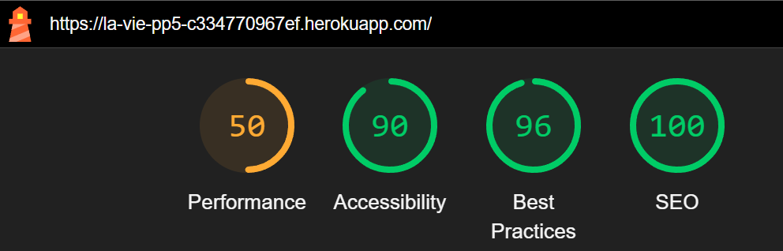
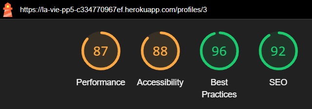
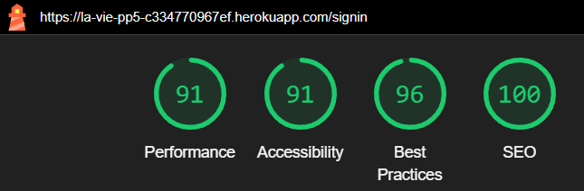
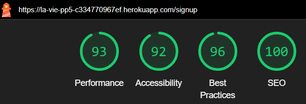

## Validations

- **HTML Validation**: Clear, [W3C Validator](https://validator.w3.org/)  
  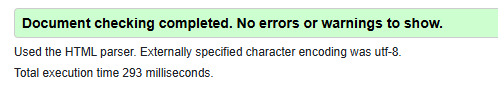

- **CSS Validation**: Clear, with some warnings (not critical), [CSS Validator](https://jigsaw.w3.org/css-validator/)  
  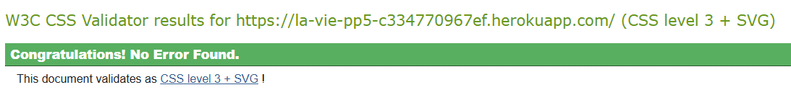

- **JS Validation**: Clear with JSHint.

## Manual Testing

    
<strong>Navigation & Footer</strong>

    <table>
        <thead>
            <tr>
                <th>Test Name</th>
                <th>Steps</th>
                <th>Expected Result</th>
                <th>Actual Result</th>
                <th>Pass/Fail</th>
            </tr>
        </thead>
        <tbody>
            <tr>
                <td>Home Navigation</td>
                <td>
                    1. Click on the <strong>🏠</strong> link.
                </td>
                <td>User is redirected to the homepage.</td>
                <td>[Same as Expected]</td>
                <td>&#10003;</td>
            </tr>
            <tr>
                <td>Profile Navigation</td>
                <td>
                    1. Click on the <strong>Profile</strong> link.
                </td>
                <td>User is redirected to the profile page.</td>
                <td>[Same as Expected]</td>
                <td>&#10003;</td>
            </tr>
            <tr>
                <td>Sign In Navigation</td>
                <td>
                    1. Click on the <strong>Sign In</strong> link.
                </td>
                <td>User is redirected to the sign-in page.</td>
                <td>[Same as Expected]</td>
                <td>&#10003;</td>
            </tr>
            <tr>
                <td>Sign Up Navigation</td>
                <td>
                    1. Click on the <strong>Sign Up</strong> link.
                </td>
                <td>User is redirected to the sign-up page.</td>
                <td>[Same as Expected]</td>
                <td>&#10003;</td>
            </tr>
            <tr>
                <td>Feed Navigation</td>
                <td>
                    1. Click on the <strong>Feed</strong> link.
                </td>
                <td>User is redirected to the feed page.</td>
                <td>[Same as Expected]</td>
                <td>&#10003;</td>
            </tr>
            <tr>
                <td>Liked Navigation</td>
                <td>
                    1. Click on the <strong>Liked</strong> link.
                </td>
                <td>User is redirected to the liked posts page.</td>
                <td>[Same as Expected]</td>
                <td>&#10003;</td>
            </tr>
            <tr>
                <td>Notifications Panel</td>
                <td>
                    1. Click on the <strong>🔔</strong> bell icon.
                </td>
                <td>Notifications panel opens.</td>
                <td>[Same as Expected]</td>
                <td>&#10003;</td>
            </tr>
            <tr>
                <td>Light/Dark Mode Toggle</td>
                <td>
                    1. Click on the light/dark toggle button.
                </td>
                <td>Page theme toggles between light and dark.</td>
                <td>[Same as Expected]</td>
                <td>&#10003;</td>
            </tr>
            <tr>
                <td>Footer Links</td>
                <td>
                    1. Click on the <strong>My LinkedIn</strong> link. 
                    2. Click on the <strong>My GitHub</strong> link.
                </td>
                <td>User is redirected to LinkedIn and GitHub pages in new tabs.</td>
                <td>[Same as Expected]</td>
                <td>&#10003;</td>
            </tr>
        </tbody>
    </table>
    

        

            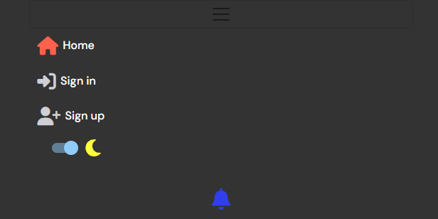
            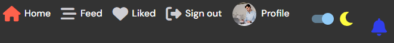
            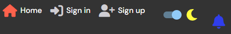
            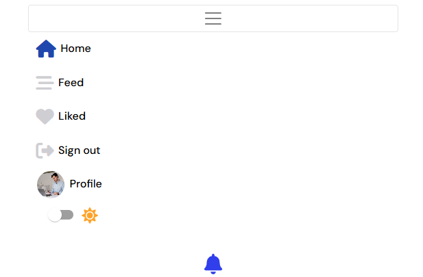
            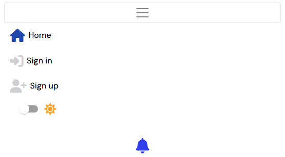
            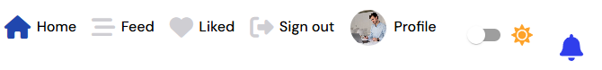
            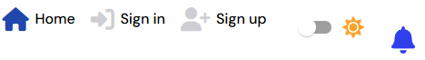
        

    

    

        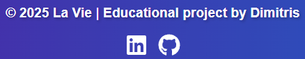
    

  
<strong>Homepage</strong>

  <table>
    <thead>
      <tr>
        <th>Test Name</th>
        <th>Steps</th>
        <th>Expected Result</th>
        <th>Actual Result</th>
        <th>Pass/Fail</th>
      </tr>
    </thead>
    <tbody>
      <tr>
        <td>Homepage Layout</td>
        <td>
          1. Navigate to the homepage. 
          2. Ensure the dynamic feed, logo, and buttons are visible.
        </td>
        <td>Homepage displays a feed of posts with a logo and <strong>Add Post</strong> button.</td>
        <td>[Same as Expected]</td>
        <td>&#10003;</td>
      </tr>
      <tr>
        <td>Search Posts Bar</td>
        <td>
          1. Type letters into the <strong>search posts bar</strong>.
        </td>
        <td>Real-time search results are shown for posts and authors.</td>
        <td>[Same as Expected]</td>
        <td>&#10003;</td>
      </tr>
      <tr>
        <td>Most Followed Profiles</td>
        <td>
          1. Check the right sidebar for the list of <strong>most followed profiles</strong>.
        </td>
        <td>The most followed profiles list is displayed, with the option to follow/unfollow.</td>
        <td>[Same as Expected]</td>
        <td>&#10003;</td>
      </tr>
    </tbody>
  </table>
  

    

      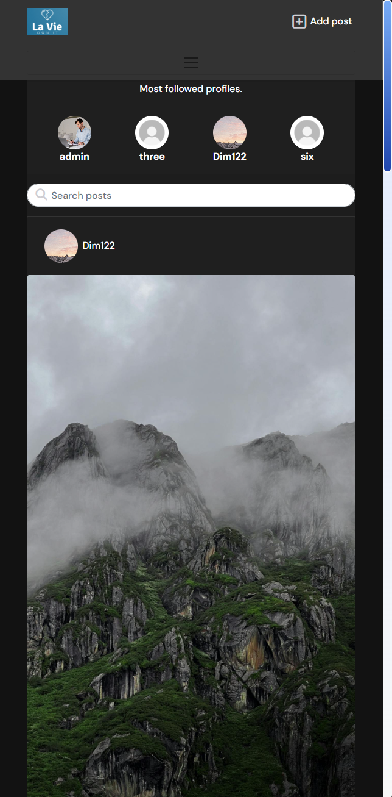
      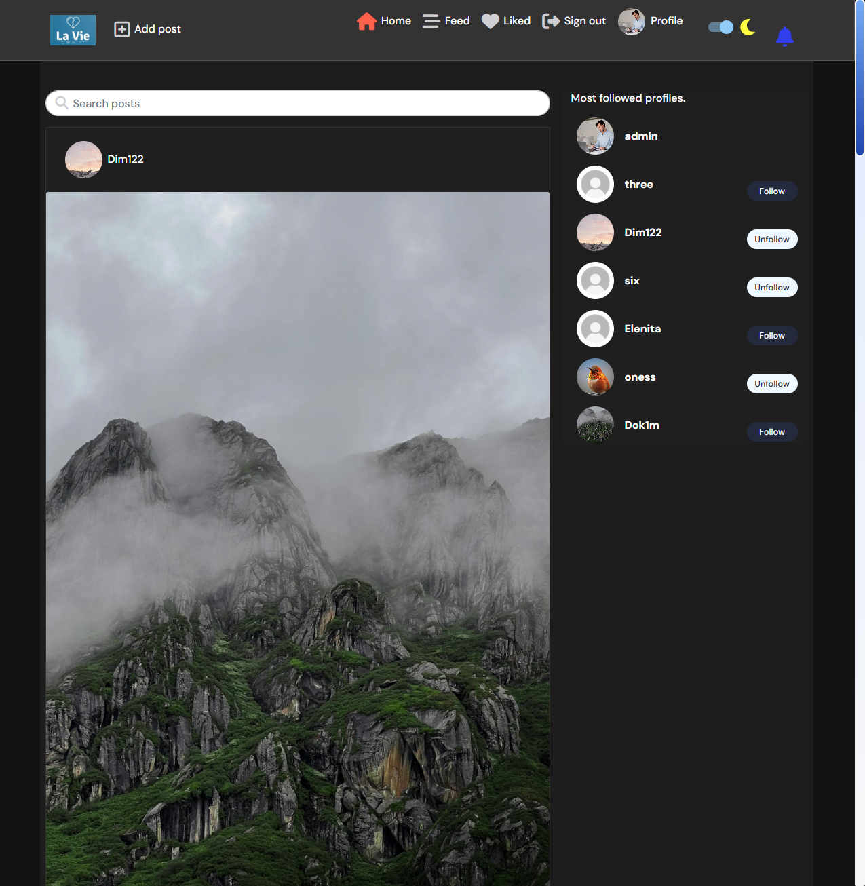
      
      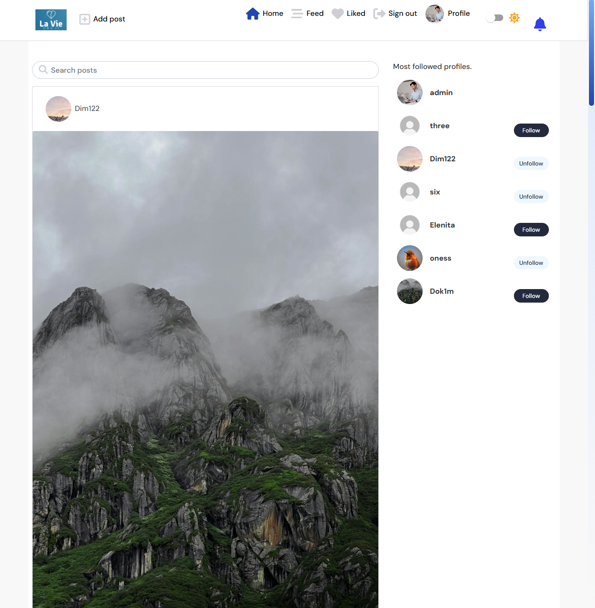
    

  

  
<strong>Create - Edit - Delete Post</strong>

  <table>
    <thead>
      <tr>
        <th>Test Name</th>
        <th>Steps</th>
        <th>Expected Result</th>
        <th>Actual Result</th>
        <th>Pass/Fail</th>
      </tr>
    </thead>
    <tbody>
      <tr>
        <td>Create Post</td>
        <td>
          1. Click on the <strong>"Upload"</strong> icon. 
          2. Upload an image, enter the title and content for the post. 
          3. Click <strong>Create</strong> once all fields are filled.
        </td>
        <td>Post is created, and user is redirected to the post page with a success message.</td>
        <td>[Same as Expected]</td>
        <td>&#10003;</td>
      </tr>
      <tr>
        <td>Create Post - Missing Fields</td>
        <td>
          1. Click on the <strong>"Upload"</strong> icon. 
          2. Leave one or more fields (image, title, or content) blank. 
          3. Try to click <strong>Create</strong>.
        </td>
        <td>The <strong>Create</strong> button remains disabled until all fields are filled.</td>
        <td>[Same as Expected]</td>
        <td>&#10003;</td>
      </tr>
      <tr>
        <td>Edit Post</td>
        <td>
          1. Click on the <strong>More</strong> dropdown on a post. 
          2. Select <strong>Edit</strong>. 
          3. Modify title, content, and image, then save changes.
        </td>
        <td>Post is updated and changes are reflected on the post page.</td>
        <td>[Same as Expected]</td>
        <td>&#10003;</td>
      </tr>
      <tr>
        <td>Edit Post - Missing Fields</td>
        <td>
          1. Click on the <strong>More</strong> dropdown on a post. 
          2. Select <strong>Edit</strong>. 
          3. Remove title, content, or image, then try to save changes.
        </td>
        <td>The <strong>Save Changes</strong> button remains disabled until all fields are filled.</td>
        <td>[Same as Expected]</td>
        <td>&#10003;</td>
      </tr>
      <tr>
        <td>Delete Post</td>
        <td>
          1. Click on the <strong>More</strong> dropdown on a post. 
          2. Select <strong>Delete</strong>.
        </td>
        <td>Post is removed from the platform and user is redirected to the homepage.</td>
        <td>[Same as Expected]</td>
        <td>&#10003;</td>
      </tr>
    </tbody>
  </table>
  

    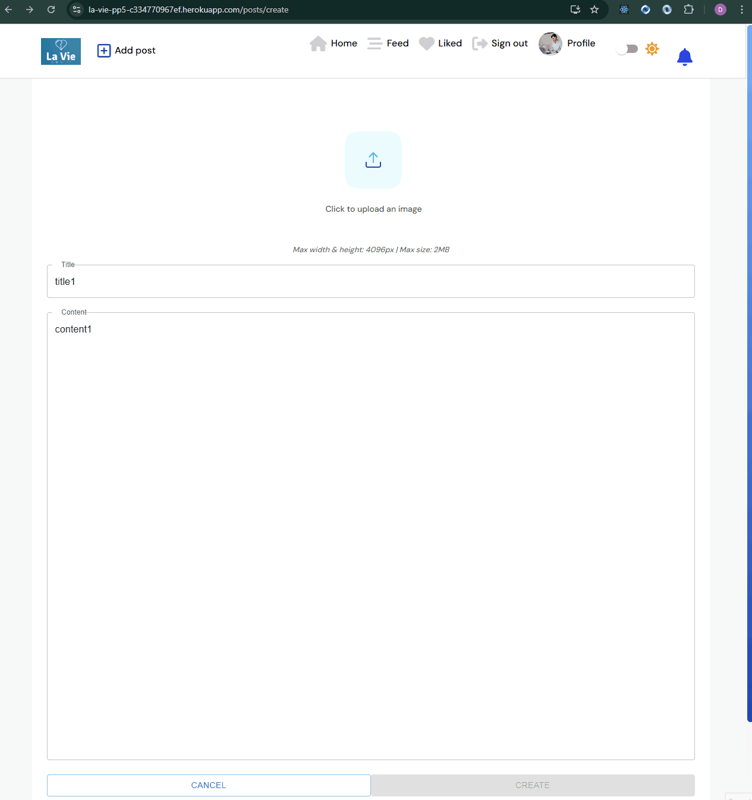
  

  
<strong>Post Page</strong>

  <table>
    <thead>
      <tr>
        <th>Test Name</th>
        <th>Steps</th>
        <th>Expected Result</th>
        <th>Actual Result</th>
        <th>Pass/Fail</th>
      </tr>
    </thead>
    <tbody>
      <tr>
        <td>View Post Details</td>
        <td>
          1. Navigate to a specific post page. 
          2. Check if the post's image, author info, title, and content are displayed.
        </td>
        <td>The full post with image, author info, title, and content should be visible.</td>
        <td>[Same as Expected]</td>
        <td>&#10003;</td>
      </tr>
      <tr>
        <td>Like Post (Logged In User)</td>
        <td>
          1. Ensure the user is logged in. 
          2. Click the heart icon to like the post.
        </td>
        <td>The heart icon changes to a filled state, indicating the post is liked.</td>
        <td>[Same as Expected]</td>
        <td>&#10003;</td>
      </tr>
      <tr>
        <td>Like Post (Non-Owner)</td>
        <td>
          1. Ensure the user is logged in. 
          2. Attempt to like a post owned by another user.
        </td>
        <td>The post can be liked successfully, provided the user is not the owner.</td>
        <td>[Same as Expected]</td>
        <td>&#10003;</td>
      </tr>
      <tr>
        <td>Report Post</td>
        <td>
          1. Ensure the user is logged in and not the post owner. 
          2. Click on the flag icon to report the post.
        </td>
        <td>The post is marked as reported and a confirmation message appears.</td>
        <td>[Same as Expected]</td>
        <td>&#10003;</td>
      </tr>
      <tr>
        <td>Write Comment</td>
        <td>
          1. Ensure the user is logged in. 
          2. Type a comment in the "Write your comment..." text area. 
          3. Click on the Post button to submit.
        </td>
        <td>The comment is displayed below the post, in chronological order.</td>
        <td>[Same as Expected]</td>
        <td>&#10003;</td>
      </tr>
      <tr>
        <td>Infinite Scroll for Comments</td>
        <td>
          1. Scroll down to the comment section. 
          2. Wait for more comments to load.
        </td>
        <td>The comments section should load more comments as the user scrolls.</td>
        <td>[Same as Expected]</td>
        <td>&#10003;</td>
      </tr>
      <tr>
        <td>Delete Comment</td>
        <td>
          1. Ensure the user is logged in. 
          2. Click on the "Delete" button next to their own comment.
        </td>
        <td>The comment should be removed from the post.</td>
        <td>[Same as Expected]</td>
        <td>&#10003;</td>
      </tr>
    </tbody>
  </table>
  

    
  

  
<strong>Own Profile Page</strong>

  <table>
    <thead>
      <tr>
        <th>Test Name</th>
        <th>Steps</th>
        <th>Expected Result</th>
        <th>Actual Result</th>
        <th>Pass/Fail</th>
      </tr>
    </thead>
    <tbody>
      <tr>
        <td>View Profile Information</td>
        <td>
          1. Navigate to the own profile page. 
          2. Check if the avatar, username, posts count, followers count, following count, and bio are visible.
        </td>
        <td>All profile details should be displayed as expected.</td>
        <td>[Same as Expected]</td>
        <td>&#10003;</td>
      </tr>
      <tr>
        <td>Click on "Edit Profile"</td>
        <td>
          1. Click on the three dots menu. 
          2. Click "Edit Profile".
        </td>
        <td>User is redirected to the profile edit page with fields for avatar and bio.</td>
        <td>[Same as Expected]</td>
        <td>&#10003;</td>
      </tr>
      <tr>
        <td>Change Username</td>
        <td>
          1. Click on the three dots menu. 
          2. Click "Change Username". 
          3. Enter a new username and click Save.
        </td>
        <td>The username is updated successfully and reflected on the profile page.</td>
        <td>[Same as Expected]</td>
        <td>&#10003;</td>
      </tr>
      <tr>
        <td>Change Password</td>
        <td>
          1. Click on the three dots menu. 
          2. Click "Change Password". 
          3. Enter a new password and confirm it. 
          4. Click Save.
        </td>
        <td>The password is successfully changed.</td>
        <td>[Same as Expected]</td>
        <td>&#10003;</td>
      </tr>
      <tr>
        <td>View Reports</td>
        <td>
          1. Click on the three dots menu. 
          2. Click "Reports".
        </td>
        <td>A modal displaying the list of reported users and posts by reported users should appear.</td>
        <td>[Same as Expected]</td>
        <td>&#10003;</td>
      </tr>
      <tr>
        <td>View Blocked Users</td>
        <td>
          1. Click on the three dots menu. 
          2. Click "Blocked Users".
        </td>
        <td>A modal displaying the list of blocked users should appear.</td>
        <td>[Same as Expected]</td>
        <td>&#10003;</td>
      </tr>
      <tr>
        <td>View User Posts</td>
        <td>
          1. Scroll down to the "Username's Posts" section. 
          2. If posts exist, they should be listed and clickable.
        </td>
        <td>The posts should be visible and clickable, leading to the post's specific page.</td>
        <td>[Same as Expected]</td>
        <td>&#10003;</td>
      </tr>
      <tr>
        <td>No Posts Available</td>
        <td>
          1. Ensure the user has not created any posts. 
          2. Navigate to the "Username's Posts" section.
        </td>
        <td>The message "No results found. _Username_ hasn't posted yet." should be displayed.</td>
        <td>[Same as Expected]</td>
        <td>&#10003;</td>
      </tr>
    </tbody>
  </table>
  

    
  

<strong>Report Profile - not working on final product -> </strong><a href="https://github.com/Dimitris112/La-Vie-pp5?tab=readme-ov-file#unfixed-bugs">Reason</a>

  <table>
    <thead>
      <tr>
        <th>Test Name</th>
        <th>Steps</th>
        <th>Expected Result</th>
        <th>Actual Result</th>
        <th>Pass/Fail</th>
      </tr>
    </thead>
    <tbody>
      <tr>
        <td>Open Report Modal</td>
        <td>
          1. Click the "Report" button on another user's profile page.
        </td>
        <td>The report modal opens with the profile name and a text area for the reason.</td>
        <td>[Same as Expected]</td>
        <td>&#10003;</td>
      </tr>
      <tr>
        <td>Submit Report</td>
        <td>
          1. Fill in the reason for reporting. 
          2. Click "Submit Report".
        </td>
        <td>The report is successfully submitted, and the user is redirected to the reports page.</td>
        <td>[Same as Expected]</td>
        <td>&#10003;</td>
      </tr>
      <tr>
        <td>Cancel Report</td>
        <td>
          1. Click the "Cancel" button on the report modal.
        </td>
        <td>The modal closes and the user returns to the profile page.</td>
        <td>[Same as Expected]</td>
        <td>&#10003;</td>
      </tr>
      <tr>
        <td>Redirect After Submission</td>
        <td>
          1. Submit a report. 
          2. Check if the user is redirected to their reports page.
        </td>
        <td>The user is redirected to the reports page, and the "Reported User" block is updated with the new report.</td>
        <td>[Same as Expected]</td>
        <td>&#10003;</td>
      </tr>
      <tr>
        <td>Check Report Status</td>
        <td>
          1. View the newly created report on the user's reports page.
        </td>
        <td>The report appears with a "New" status, as defined in the `STATUS_CHOICES`.</td>
        <td>[Same as Expected]</td>
        <td>&#10003;</td>
      </tr>
    </tbody>
  </table>
  

    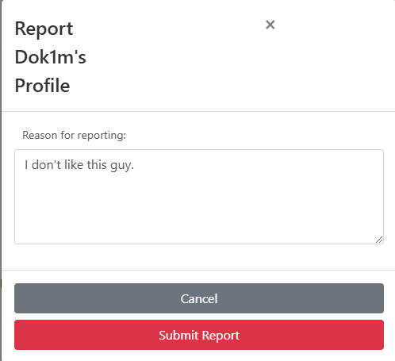
  

  
<strong>Report Post - not working on final product -> </strong><a href="https://github.com/Dimitris112/La-Vie-pp5?tab=readme-ov-file#unfixed-bugs">Reason</a></strong>

  <table>
    <thead>
      <tr>
        <th>Test Name</th>
        <th>Steps</th>
        <th>Expected Result</th>
        <th>Actual Result</th>
        <th>Pass/Fail</th>
      </tr>
    </thead>
    <tbody>
      <tr>
        <td>Open Report Modal (Not Owner)</td>
        <td>
          1. Navigate to a post on the homepage or post page. 
          2. Ensure the post is not owned by the logged-in user. 
          3. Click the "flag" icon to report the post.
        </td>
        <td>The report modal opens with the post title, a dropdown menu for reasons, a text area for details, and a confirmation checkbox.</td>
        <td>[Same as Expected]</td>
        <td>&#10003;</td>
      </tr>
      <tr>
        <td>Open Report Modal (Owner)</td>
        <td>
          1. Navigate to a post on the homepage or post page. 
          2. Ensure the post is owned by the logged-in user. 
          3. Try clicking the "flag" icon to report the post.
        </td>
        <td>The report modal does not open, and an alert/message should notify the user they cannot report their own post.</td>
        <td>[Same as Expected]</td>
        <td>&#10003;</td>
      </tr>
      <tr>
        <td>Submit Report</td>
        <td>
          1. Open the report modal for a post that is not owned by the logged-in user. 
          2. Select a reason from the dropdown (e.g., "Harassment"). 
          3. Enter optional details in the "Details" text area. 
          4. Check the confirmation checkbox. 
          5. Click "Submit Report".
        </td>
        <td>The report is submitted successfully, the modal closes, and the user is redirected to their "Reports" page. The report is saved with status "New".</td>
        <td>[Same as Expected]</td>
        <td>&#10003;</td>
      </tr>
      <tr>
        <td>Cancel Report</td>
        <td>
          1. Open the report modal for a post. 
          2. Click the "Cancel" button.
        </td>
        <td>The modal closes, and the user is returned to the post page without submitting a report.</td>
        <td>[Same as Expected]</td>
        <td>&#10003;</td>
      </tr>
      <tr>
        <td>Check Report Status</td>
        <td>
          1. Submit a report for a post. 
          2. Navigate to the "Reports" page. 
          3. Verify the newly created report is displayed under the "Posts by Reported Users" section. 
          4. Check that the report status is set to "New".
        </td>
        <td>The report is displayed with a "New" status, and the "No posts found for reported users." message is removed if it was the first report.</td>
        <td>[Same as Expected]</td>
        <td>&#10003;</td>
      </tr>
      <tr>
        <td>Verify Reported Post Information</td>
        <td>
          1. Submit a report for a post. 
          2. Navigate to the "Reports" page. 
          3. Verify that the reported post is correctly listed under "Posts by Reported Users". 
          4. Ensure the post's details (title, reason for report) match the report submission.
        </td>
        <td>The report should include the correct post details, including the selected reason for reporting and any additional details provided by the user.</td>
        <td>[Same as Expected]</td>
        <td>&#10003;</td>
      </tr>
    </tbody>
  </table>
  

    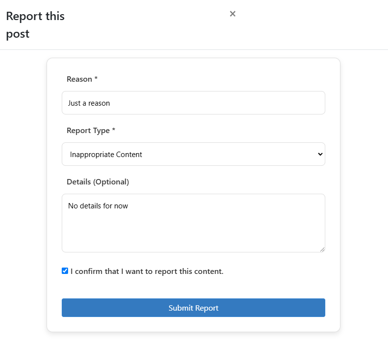
  

  
<strong>Block User - not working on final product -> </strong><a href="https://github.com/Dimitris112/La-Vie-pp5?tab=readme-ov-file#unfixed-bugs">Reason</a></strong>

  <table>
    <thead>
      <tr>
        <th>Test Name</th>
        <th>Steps</th>
        <th>Expected Result</th>
        <th>Actual Result</th>
        <th>Pass/Fail</th>
      </tr>
    </thead>
    <tbody>
      <tr>
        <td>Block User</td>
        <td>
          1. Navigate to another user's profile page. 
          2. Click the red "Block" button on the profile page.
        </td>
        <td>The blocked user is removed from the feed, and their username appears in the "Blocked Users" section of the logged-in user's profile with the block date and an unblock button.</td>
        <td>[Same as Expected]</td>
        <td>&#10003;</td>
      </tr>
      <tr>
        <td>Blocked User is Removed from Feed</td>
        <td>
          1. Block a user. 
          2. Navigate back to the feed or other sections. 
          3. Verify the blocked user no longer appears in the feed or other sections.
        </td>
        <td>The blocked user should not be visible anywhere in the feed or app after being blocked.</td>
        <td>[Same as Expected]</td>
        <td>&#10003;</td>
      </tr>
      <tr>
        <td>Blocked User Added to Blocked List</td>
        <td>
          1. Block a user. 
          2. Go to the "Blocked Users" section under the profile page. 
          3. Check if the blocked user is listed with the correct block date.
        </td>
        <td>The blocked user's name appears in the "Blocked Users" section along with the block date and the "Unblock" button.</td>
        <td>[Same as Expected]</td>
        <td>&#10003;</td>
      </tr>
      <tr>
        <td>Unblock User</td>
        <td>
          1. Go to the "Blocked Users" section. 
          2. Click the "Unblock" button next to a blocked user.
        </td>
        <td>The user is removed from the blocked list, their profile becomes visible again in the app, but the follow relationship is not restored automatically.</td>
        <td>[Same as Expected]</td>
        <td>&#10003;</td>
      </tr>
      <tr>
        <td>Check Blocked User After Unblock</td>
        <td>
          1. Unblock a user. 
          2. Go to the "Blocked Users" section. 
          3. Verify that the blocked user is no longer listed.
        </td>
        <td>The blocked user should no longer appear in the "Blocked Users" section after being unblocked.</td>
        <td>[Same as Expected]</td>
        <td>&#10003;</td>
      </tr>
      <tr>
        <td>Follow Relationship After Unblock</td>
        <td>
          1. Unblock a user. 
          2. Check if the follow relationship with the user is automatically restored.
        </td>
        <td>The follow relationship is not restored. The user must manually follow the profile again.</td>
        <td>[Same as Expected]</td>
        <td>&#10003;</td>
      </tr>
      <tr>
        <td>Check Blocked Users Message</td>
        <td>
          1. Visit the "Blocked Users" section before blocking any users. 
          2. Verify that the message "No blocked users found." is displayed.
        </td>
        <td>The "No blocked users found." message should appear if no users have been blocked.</td>
        <td>[Same as Expected]</td>
        <td>&#10003;</td>
      </tr>
    </tbody>
  </table>
  

    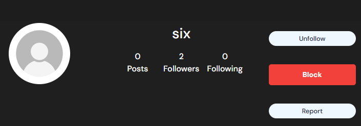
  

